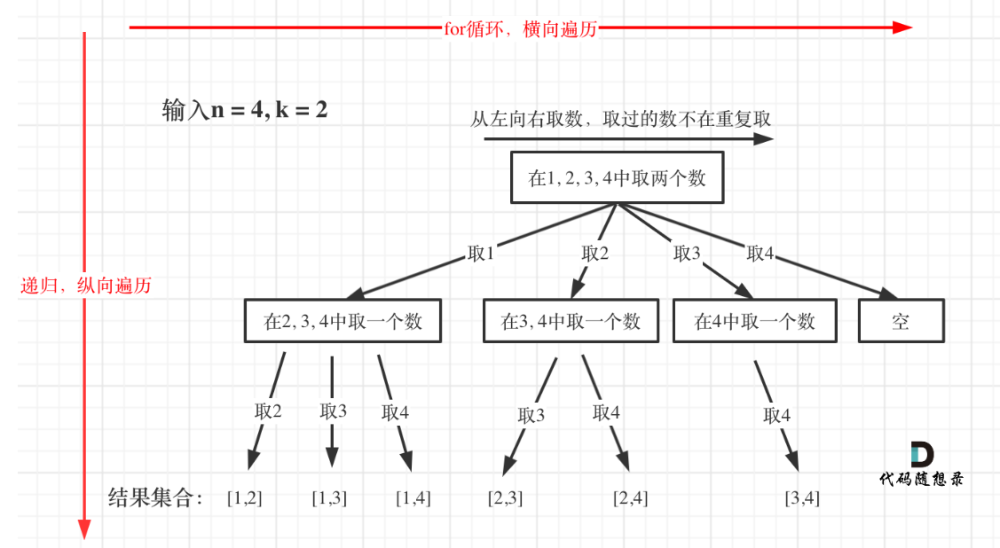
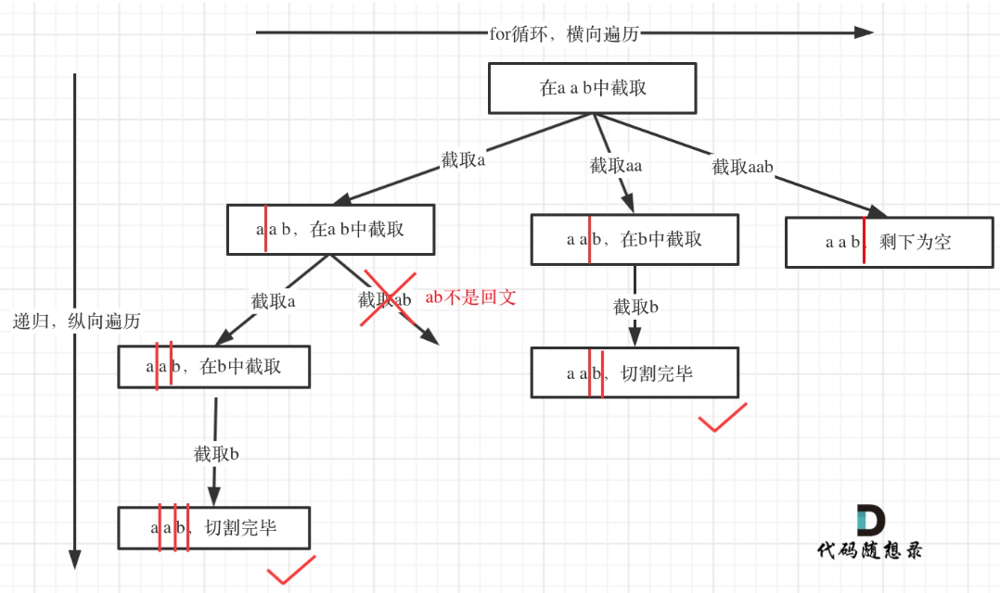
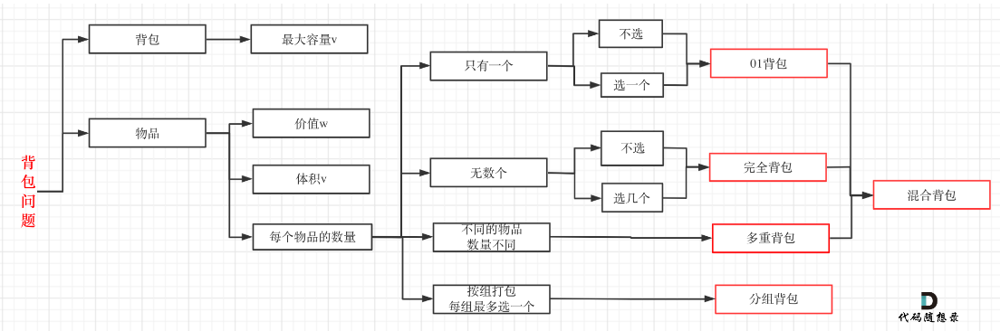
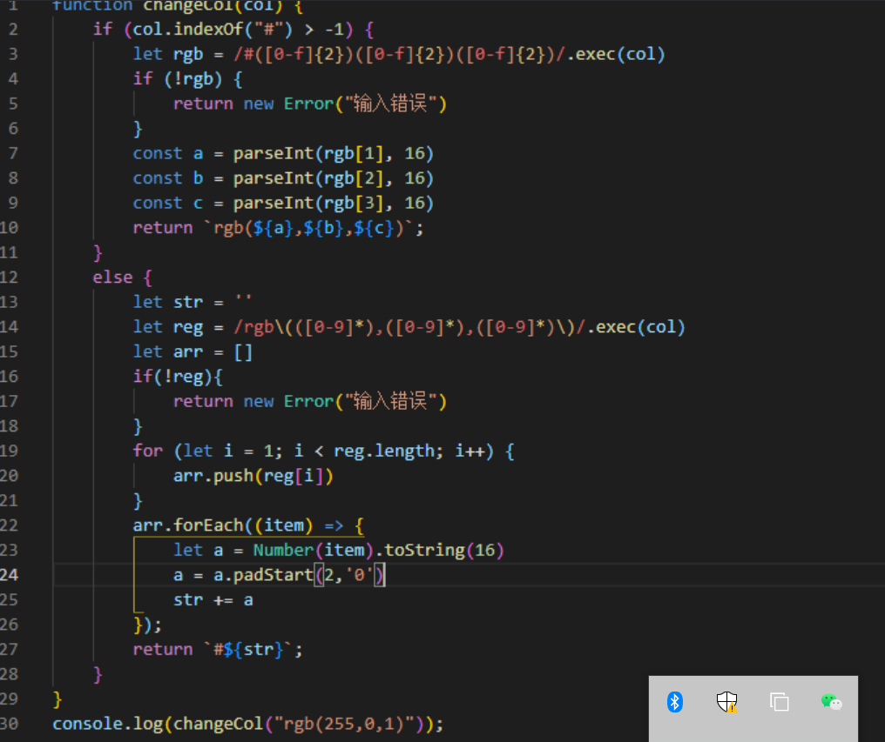

# 刷题资料

1. 代码随想录：pdf、公众号
2. 剑指offer
3. hot100

# JS知识点

## 1. **JS除法“/”**

* 返回的是小数，不会取整。取整的方法：

  * Math.round()：四舍五入
  * Math.floor()：向下取整
  * Math.ceil()：向上取整

## 2. j**s数组排序**：

* 使用sort方法，sort方法可以将数组中的元素转化为string类型进行比较。如果是对数num进行排序的话，需要在参数中传入比较函数

```javascript
let nums = [1,10,5];
nums.sort((a, b) => a - b)	// a小于b的话，返回负值；a大于b的话，返回正值；a等于b的话，返回0
```

## 3. **js创建二维数组**：

* 使用Array.from()函数（from函数是ES6新增的创建数组的静态方法）。from函数用于将类数组结构转换为数组结构。from函数可以接收第二个参数，用于增强新数组的值，（新数组中的每一个值都会执行该回调函数）

  ```javascript
  let nums = Array.from(new Array(3), () => new Array(3));
  let nums = new Array().fill().map(() => new Array())//注意这里用了fill(),参数为空填充的是undefined
  let nums = []
  ```

  * 当一个对象被传递给 `fill` 方法的时候，填充数组的是这个对象的引用。


3. string类型不可变

4. 需要注意的是，**js中的字符串是不可变的。**如果想要对字符串赋值，必须生成新的字符串。

   * 这里采用**s.split("")**的方法，将字符串按照字符进行拆分，得到数组

   * 再使用**arr.join("")**的方法，将数组中的各元素连接起来，生成字符串


## 4. js数组拷贝

* 向二维数组中push一维数组，不可以直接arr2.puhs(arr1),  这样是浅拷贝，push的是引用地址，没有用。要深拷贝，

  ```javascript
   result.push([...queue]);    //注意点，要深拷贝，不可以写res.push(queue)，三个点是解构
  ```

## 5. **字符编码**

   * JS中使用charCodeAt()函数可以查看指定索引位置的码元值，UNICODE编码，

   * Unicode编码中

     * A-Z： 65 - 90
     * a-z：97 - 122
     * 0 - 9：48 - 57

   * 应用：leetcode125：验证回文串

   * ```javascript
     var isPalindrome = function(s) {
         var i = 0, j = s.length - 1;
         while(i < j) {
             while(!isNumLetter(s[i].toLowerCase().charCodeAt(0)) && i < j) {
                 i++;
             }
             while(!isNumLetter(s[j].toLowerCase().charCodeAt(0)) && i < j) {
                 j--;
             }
             if(s[i].toLowerCase().charCodeAt(0) != s[j].toLowerCase().charCodeAt(0)) {
                 return false;
             }
             i++;j--;
         }
         return true;
     };
     ```

   * toUpperCase()这类函数返回的是新的string字符串

## 6. 值的范围

* 最大值：`Number.MAX_VALUE`  ,   `infinity`
* 最小值：`Number.MIN_VALUE`  ,   `-infinity`

## 7. 数组的splice函数

* splice函数用于删除、插入、替换数组的元素（可实现在数组的任意位置添加指定数量的元素，在数组的任意位置删除指定数量的元素）
* 三个参数：
  1. 指定删除或插入元素数组的位置
  2. 删除元素的个数。为0代表不删除元素
  3. 第三个参数可选，替换元素
* inplace操作，直接修改原数组（sort函数也是）

```javascript
queue.splice(index, 0, people[i])
```


# 算法

## 双指针

1. **有序数组的两数和：**在有序数组中找出两个数，使它们的和为target。

   > 使用双指针，一个指针指向值较小的元素，一个指针指向值较大的元素。指向较小元素的指针从头向尾遍历，指向较大元素的指针从尾向头遍历。

2. **两数平方和**：判断一个非负整数是否为两个整数的平方和。

   >双指针，左指针从0开始，右指针从target的根号开始，应用sqrt函数开根号。sum=left*left+right+right。分三种情况：
   >
   >* sum==target。返回true
   >* sum>target。right--
   >* sum<target。left++

   ```js
   bool judgeSquareSum(int c) {
           int i=0;
           long j=sqrt(c);
           while(i<=j){
               long sum=i*i+j*j;
               if(sum==c)
                   return true;
               else if(sum<c)
                   i++;
               else
                   j--;
           }
           return false;
       }数据结构
   ```


# 数据结构

## 数组

#### 1. 二分查找

* **使用前提：**二分查找前提有两个：1是数组为有序数组；2是数组中无重复元素

* **重点：**把握区间的定义，区间的定义就是不变量

* **详细方法**：对于区间左闭右闭的情况：

  * while (left <= right) 要使用 <= ，因为left == right是有意义的，所以使用 <=
  * if (nums[middle] > target) right 要赋值为 middle - 1，因为当前这个nums[middle]一定不是target，那么接下来要查找的左区间结束下标位置就是 middle - 1

* **例题**：704.二分查找

  ```javascript
  var search = function(nums, target) {
      var left = 0, right = nums.length-1, mid;
      while (left <= right) {
          mid = Math.floor((left+right) / 2);
          if (nums[mid] < target) {
              left = mid + 1;
          }else if (nums[mid] > target) {
              right = mid - 1;
          }else {
              return mid;
          }
      }
      return -1;
  };
  ```

* 例题：34.在排序数组中查找元素的第一个和最后一个位置

  * 该方法分别利用二分查找方法寻找左边界和右边界

#### 2. 移除元素

* 移除数组中的指定元素，需考虑数组中删除元素只能覆盖

* **例题：** 27. 移除元素

  * 方法：采用快慢指针的方法，慢指针指向新数组的元素，快指针用于筛选新数组

  ```javascript
  /**
   * 双指针，low指针指向结果数组，fast指针指向nums数组
   * fast指针判断curValue是否等于val，如果等于val，则fast++，直到curValue!=val
   * 然后把fast指向的val赋值给low
   */
  var removeElement = function(nums, val) {
      var low = 0, fast = 0;
      while(fast < nums.length) {
          if(nums[fast] != val){
              nums[low] = nums[fast];
              low++;
              fast++;
          }else {
              fast++;
          }
      }
      return low;
  };
  ```

* **例题：**977. 有序数组的平方

  * 方法：考虑到数组的有序，以0为分割点，分为两段采用**归并排序**的方法
  * 也可使用双指针法

  ```javascript
  /**
   * 目的是找到平方之后的顺序，需要注意的是，数组正数和负数都是有序的
   * 平方之后，最大值一定是在数组的两端取的，所以设置双指针，分别指向数组的头和尾
   * 依次向中遍历，取最大值放在结果数组的末端
   */
  //双指针的解法
  var sortedSquares = function(nums) {
      let result = new Array(nums.length).fill(0);
      let i = 0, j = nums.length - 1;
      let k = nums.length -1;
      while(i <= j) {
          let iSqure = nums[i] * nums[i];
          let jSqure = nums[j] * nums[j];
          if(iSqure >= jSqure) {
              result[k] = iSqure;
              i++;
          }else {
              result[k] = jSqure;
              j--;
          }
          k--;
      }
      return result;
  };
  ```

  

#### 3. 长度最小的子数组209

* 找出一段子序列且大于target的子序列，返回该序列的长度。**找出满足条件的最小子序列**

* **方法：**采用**滑动窗口**的方法，相当于双指针。不断更新滑动窗口的起始位置和终止位置，来更新滑动窗口数值的总和

* **代码**：

  ```javascript
  //i:起始位置； j:终止位置； sum子序列的和； ans子序列结果长度，初始化为最大值
  i = 0, j = 0, sum = 0, ans = MAX;
  for (; j < nums.length; j++) {
      sum += nums[j];
      while (sum >= target) {	//满足条件之后不断的更新左指针来缩小窗口，找到最小序列
          subL = j - i + 1;
          ans = ans > subL ? subL : ans;
          sum -= num[i];	//这里很重要，找到sum>target后，需要更新滑动窗口，而更新滑动窗口是通过移动起始位置来更新的，
          i++;
      }
  }
  return ans != MAX ? ans : 0;
  
  let i = 0, j = 0;
  let result = Number.MAX_VALUE;
  let len = Number.MAX_VALUE;
  let count = nums[0];	//count记录目前加和结果
  while(j < nums.length) {
      count += nums[j];
      while(count >= target) {	//满足条件之后，不断的缩小左指针
          len = j-i+1;
          result = Math.min(result, len);
          count -= nums[i]; 
          i++;
  
      }
      j++;
  }
  return result;
  ```

#### 4. **水果成篮904**

* **找出满足某一条件的最大子序列。**该条件为保证子序列中的水果种类不超过2种

* 要点：滑动窗口，当不满足条件之后，不断的缩小左指针，从而找到每一种可能性。

* 注意点：条件的判断篮子中种类不能超过两类，给篮子建立哈希表，当篮子map的size大于2之后，即为不满足条件，这个时候就更新 i 指针。

* 代码：

* ```javascript
  /**
   * 采摘水果时，需要考虑当前篮子中的情况
   * 如果篮子中有该水果，则可以直接放
   * 如果篮子中没有该水果，需要判断篮子的size是否大于等于2，如果大于等于2，需要把之前的水果删掉
   *      直到size小于2，就可以放入
   * 所以篮子设置map，用map表示水果的种类以及其数量
   */
  var totalFruit = function(fruits) {
      let basket = new Map();
      let j = 1;
      basket.set(fruits[0], 1);
      let i = 0;
      let result = 0;
      let re = 0;
      //for(let i = 0; i < fruits.length - 1; i++) {
          while(j < fruits.length && i <= j) {
              let re = 0;
              if(basket.has(fruits[j])) {
                  basket.set(fruits[j], basket.get(fruits[j]) + 1);
              }else {
                  while(basket.size >= 2) {
                      basket.set(fruits[i], basket.get(fruits[i]) - 1);
                      if(basket.get(fruits[i]) == 0) basket.delete(fruits[i]);
                      i++;//不满足条件之后，缩小左指针
                  }
                  //i--;
                  basket.set(fruits[j], 1);
              }
              j++;
              basket.forEach((value, key) => {
                  re += value;
              });
              result = Math.max(result, re);
          }    
      //}
      return result;
  };
  ```

* 

  ```javascript
  while (j < fruits.length) {
      if(basket.has(fruits[j])) {
          basket.set(fruits[j], basket.get(fruits[j])+1);
      }else {
          basket.set(fruits[j],1) ;
      }
      len = j - i + 1;      
      while(basket.size > 2) {      // 不满足条件之后，更新i指针，寻找另一种可能性（即以j结尾且满足条件的子序列）
          basket.set(fruits[i],basket.get(fruits[i])-1);
          if(basket.get(fruits[i]) == 0 ){
              basket.delete(fruits[i])
          }
          i++;
          len--;	// 缩小长度len
      }
      result = len > result ? len : result;
      j++;
  }
  ```

#### 5. **最小覆盖子串76**

* **找出满足某一条件的最小序列。**该条件为保证子序列中的字符及个数覆盖目标子串中的字符及个数

* **要点：**滑动窗口，**当满足条件之后，不断的更新左指针，缩小窗口的大小，从而找到最小窗口**

* 注意点：条件的判断采用哈希表

* 难点：如何判断子串（当前窗口）覆盖t的所有字符？

* 方法：用哈希表表示t中所有的字符以及他们的个数，

  ​		   用哈希表表示当前窗口的所有字符以及他们的个数

  ​		   如果第二个动态哈希表中包含第一个哈希表中所有的字符，并且字符个数不小于t的哈希表的个数。则满足条件（覆盖t中所有字符）

```javascript
/**
 * 题解：滑动窗口，寻找满足覆盖t中所有字符的最小子串
 * 难点：如何判断子串（当前窗口）覆盖t的所有字符？
 * 方法：用哈希表表示t中所有的字符以及他们的个数，
 *       用哈希表表示当前窗口的所有字符以及他们的个数
 *      如果第二个动态哈希表中包含第一个哈希表中所有的字符，并且字符个数不小于t的哈希表的个数
 *       则满足条件（覆盖t中所有字符）
 */
var minWindow = function(s, t) {
    var tMap = new Map();
    var windowMap = new Map();
    var i = 0;
    for( let c of t) {
        tMap.set(c, tMap.has(c) ? tMap.get(c) + 1 : 1);
    }
    var l = -1, r = -1, len = Number.MAX_VALUE;
    var i = 0, j = 0
    while( j < s.length) {
        windowMap.set(s[j], windowMap.has(s[j]) ? windowMap.get(s[j]) + 1 : 1);
        while(check(windowMap,tMap)) {
            if( len > (j - i + 1)) {
                r = j;
                l = i;
                len = j - i + 1;
            }         
            windowMap.set(s[i], windowMap.get(s[i]) - 1)
            if(windowMap.get(s[i]) == 0) {
                windowMap.delete(s[i]);
            }
            i++;
        }
        j++;
    }
    return s.substring(l, r + 1);
};

function check(windowMap, tMap) {//检查当前滑动窗口是否覆盖t的map
    for(let pair of tMap) {
        if (!windowMap.has(pair[0])) {
            return false;
        }else if (windowMap.get(pair[0]) < pair[1]) {
            return false;
        }
    }
    return true;
}
```


####  总结：

* 当数组有序的时候，就考虑使用**二分法**，二分法注意区间的闭和开，以及mid的取值

1. 数组常用方法：**双指针，滑动窗口**，归并排序（段内有序）
2. 滑动窗口最重要的就是左右指针的移动，这里的3，4，5例题，需要区分寻找的是满足条件的最大子序列，还是满足条件的最小子序列。
   * 最大子序列：在不满足条件之后，需要移动左指针，更新窗口的大小，寻找每一种可能。
   * 最小子序列：在满足条件之后，需要移动左指针，缩小窗口的大小，找到最小序列长度
3. 相似题：1004、3

## 6. 螺旋矩阵

* 螺旋矩阵：考虑以圈数为切入点
* 注意圈数的个数、每一行位移的长度，最后的中间位置

```javascript
/**
 * 按照左闭右开的原则，四个方向一一循环填数组
 * 设置offset表示每次循环移动的位数
 * 设置starti和startj表示画圈开始的地方
 * 需注意的是，当n为奇数时，最后一圈只有一个数，这是无法通过画圈来填满，需要单独赋值
 * 
 * loop代表圈数，n对2取整的结果就是圈数,循环中使用loop判断是否循环完
 * 需注意的是，当n为奇数的时候，中间只有一个数，需要单独处理
 * 
 * startX和startY代表每次圈的起点，每次循环，加加1
 * 
 * offset表示每一行遍历的长度，每一圈都比上一圈加1
 */
var generateMatrix = function(n) {
    let result = new Array(n).fill(0).map(() => new Array(n).fill(0));

    let loop = Math.floor(n/2); //
    let startX = 0, startY = 0;//startX,
    let mid = Math.floor(n/2);
    let offset = 1;
    let num = 1;
    while(loop--) {
        let i = startX, j = startY;
        //上行：从左到右遍历，递增j
        for(; j < n - offset; j++) {
            result[i][j] = num++;
        }
        //右行：从上到下，递增i
        for(; i < n - offset; i++) {
            result[i][j] = num++;
        }
        //下行：从右到左，递减j。注意j的起始位置是startY
        for(; j > startY; j--) {
            result[i][j] = num++;
        }
        //左行：从下往上，递减i。注意i的起始位置是startX
        for(; i > startX; i--) {
            result[i][j] = num++;
        }
        offset++; //offset每次加1
        startX++;
        startY++;
    }
    if( n%2)  result[mid][mid] = num;//当n为奇数的时候，中间有一个数需要单独赋值
    return result;
};
```


## 链表

### 	1. 移除链表元素

* 设置虚拟头节点

```javascript
var removeElements = function(head, val) {
    let dummyNode = new ListNode(0, head);
    let cur = head;
    let pre = dummyNode;
    while(cur) {
        if(cur.val === val) {
            pre.next = cur.next;

        }else {
            pre = pre.next;
        }
        cur = cur.next;
    }
    return dummyNode.next;
};
```


### 2. 设计链表

### 3. 翻转链表

```javascript
/**
* 逻辑：将当前节点的next指向前一个节点preNode,然后curNode移动到下一位，preNode移动到下一位
* 虚拟头节点设置为null,作为反转后链表的尾部
*/
var reverseList = function(head) {
    let curNode = head;
    let preNode = null;
    while(curNode !==null) {
        let tempNode = curNode.next;
        curNode.next = preNode;
        preNode = curNode;
        curNode = tempNode;
    }
    return preNode;

};
```


### 4. 两两交换链表中的节点

* 画图确定交换的顺序就可以

```javascript
var swapPairs = function(head) {
    let dummyNode = new ListNode(0, head);
    if(!head || !head.next) return head;
    let ppre = dummyNode, pre = head, cur = head.next;
    while(cur && pre) {
        let temp = cur.next;
        cur.next = pre;
        ppre.next = cur;
        pre.next = temp;
        
        ppre = pre;
        pre = temp;
        if(temp) cur = temp.next;
        else cur = null;
    }
    return dummyNode.next;
};
```


### 5. 删除链表倒数第n个节点

	* 采用双指针的方法，一个slow，一个fast。fast比slow多走n步

```javascript
var removeNthFromEnd = function(head, n) {
    let dummyNode = new ListNode(0, head);//设置虚拟头节点，防止删除的节点就是头节点这种情况
    let fast = head, slow = head,preNode = dummyNode;
    while(n--) {
        fast = fast.next;
    }
    while(fast) {
        fast = fast.next;
        slow = slow.next;
        preNode = preNode.next;
    }
    preNode.next = slow.next;
    return dummyNode.next;//注意返回的结果
};
```


### 6. 链表相交

* 计算两个链表的长度之差

### 7. 环形链表

```javascript
/**
 * 环形链表，定义slow和fast指针，slow指针每次移动一位，fast指针每次移动二位
 * 判断是否有环：slow和fast指针如果相遇的话
 * 找寻环的入口：相遇节点和head节点移动相同的位移，相遇时即为环入口
 */
var detectCycle = function(head) {
    let findStart = function(node) {
        let a = head;
        let b = node;
        while(a !== b) {
            a = a.next;
            b = b.next;
        }
        return a;
    }

    let slow = head, fast = head;
    while(fast) {
        slow = slow.next;
        if(fast.next) fast = fast.next.next;
        else return null;
        if(slow == fast) {
            return findStart(slow);
        }
    }
    return null;
    
};
```


### 总结：

* 链表散乱分布在内存中的某个地址上。
* 链表的增删改操作很容易进行，但是查询不容易。
* 对于链表的一些问题可使用虚拟头节点
* 在做反转链表等操作时，先弄清楚调整的顺序，再做题。对于一些需要改变的指针，可考虑采用临时变量存储下来

## 哈希表

* 用于**快速判断一个元素是否出现在集合中**

### 1. 有效的字母异位词

* 用数组作为哈希表，因为索引为26个字母，比较集中

* 首先为字符串s建立哈希表；然后遍历t，逐步减少s哈希表中的数字；最后检查s哈希表中所有字符出现字数是否都是0

  

## 字符串

* 需要注意的是，**js中的字符串是不可变的。**如果想要对字符串赋值，必须生成新的字符串。
* 这里采用**s.split("")**的方法，将字符串按照字符进行拆分，得到数组
* 再使用**arr.join("")**的方法，将数组中的各元素连接起来，生成字符串

### 1. 反转字符串

```javascript
var reverseStr = function(s, k) {
    var len = s.length;
    let arr = s.split("");
    for(let i = 0; i < len; i += 2 * k ) {  //循环中使用2 * k作为循环项
        let l = i  - 1;
        let r = i + k > len ? len : i + k;  //r为i+ k
        while(++l < --r) {
            [arr[l], arr[r]] = [arr[r], arr[l]];
        }
    }
    return arr.join("");
};
var reverse = function(str, left, right) {
    var arr = str.split("");
    right = right - 1;
    while(left < right) {
        var temp = arr[right];
        arr[right] = arr[left];
        arr[left] = temp;
        left++;
        right--;
    }
    return arr.join("");
}
```

### 2. 左旋转字符串

* 考虑o(1)的空间复杂度，
  	1. 先翻转前部分字符串
  	2. 再翻转后部分字符串
  	3. 最后整体翻转字符串

```javascript
var reverseLeftWords = function(s, n) {
    //方法一： 使用了额外的空间
    // var tempStr = s.substring(0, n);
    // var arr = Array.from(s);
    // var slow = 0;
    // var fast = n;
    // while(fast < s.length) {
    //     arr[slow++] = arr[fast++];
    // }
    // var i = 0;
    // while(slow < s.length){
    //     arr[slow++] = s[i++];
    // }
    // return arr.join("");

    //方法二：在源字符串上进行操作
    var arr = s.split("");
    reverseWord(arr, 0, n);		//翻转前部分字符串
    reverseWord(arr, n, s.length);		//翻转后部分字符串
    reverseWord(arr, 0, s.length);		//翻转一整个字符串
    return arr.join("");
};
var reverseWord = function(str, start, end) {	//翻转字符串
    var left = start;
    var right = end - 1;
    while(left < right) {
        var temp = str[right];
        str[right] = str[left];
        str[left] = temp;
        left++;
        right--;
    }
}
```

### 3. 找出字符串中第一个匹配项的下标

* 字符串的匹配问题，KMP算法。最重要的是构建next数组（字符串的前缀和后缀）。根据next数组，来判断匹配过程中j的移动位置

  ```javascript
  /**
   * 查找字符串中子串的位置，采用KMP算法
   * KMP算法最终要的是构造next数组（找到模式串中每个字符的前缀和后缀）
   * 构造next数组：
   *  1. 定义i,j指针，i指针遍历模式串，j指针从0开始，j指针的位置就是next数组中的值
   *  2. 遍历i模式串时，如果needle[i]和needle[j]不相等的话，j移动到next[j - 1]的位置
   *  3. 如果needle[i] 和needle[j]相等的话，j++;
   *  4. 最后，把j的值赋给next[i]
   * 找索引
   *  1. 定义i，j指针，i指针遍历原串，j指针遍历模式串
   *  2. 遍历原串的时，如果haystack[i] 等于 needle[j] ，j++
   *  3. 如果不相等，则j = next[j - 1];
   *  4. 如果j等于needle的长度，则找到了匹配位置，返回结果即可
   *  5. 否则返回-1
   */
  var strStr = function(haystack, needle) {
      if(needle.length == 0) {    // 为空串，返回0
          return 0;
      }
      //构建next数组
      const getNext = (needle) => {
          let next = [];
          let j = 0;
          next.push(0);
          for(let i = 1; i < needle.length; i++) {    //  i遍历模式串
              while(j > 0 && needle[i] != needle[j]) {    //  needle[i]和needle[j]不相等的时候，移动j的位置
                  j = next[j - 1];
              }
              if(needle[i] == needle[j]) {    // 相等的时候，j++
                  j++;
              }
              next.push(j);   //j 的位置就是next数组的值
          }
          return next;
      }
      let next = getNext(needle);
      let j = 0;
      for(let i = 0; i < haystack.length; i++) {  //i遍历原串，j遍历模式串
          while(j > 0 && haystack[i] != needle[j]) {  // 不相等取next数组值
              j = next[j - 1];
          }
          if(haystack[i] == needle[j]) {
              j++;
          }
          if(j == needle.length) {
              return (i - needle.length + 1);
          }
      }
      return -1;  // 找不到，返回-1
  };
  // @lc code=end
  
  
  ```


## 双指针

## 栈与队列

### 1. 匹配问题：

* 采用栈处理（成对匹配）

### 2. 优先队列

* 普通队列：先进先出，元素在队尾追加，在队列头删除

* 优先队列：元素被赋予优先级，优先级高的最先删除，（最高级先出）。常常采用堆结构实现。
* **降序采用小顶堆，升序采用大顶堆**

### 3. 滑动窗口最大值

* 采用单调队列的数据结构，维护滑动窗口内的最大值，队列前端的元素是最大值
 * 单调队列操作：
 * push:当前元素值大于队列末端元素，弹出队列末端元素，直到队列为空，或者，当前元素小于末端元素
 * pop: 当前元素值等于队列前端元素，弹出队列前端元素。否则，不做操作
 * 这种单调队列，就可以维持当前滑动窗口的最大值在队列前端

### 4. 前K个高频元素

* 首先借助map，记录每个元素出现的次数
* 前k个高频元素，是降序，采用小顶堆。当堆内元素超过k个之后，弹出最小的元素，就可以保证剩下的是前k个高频元素
* 构造堆的过程：（堆可以使用数组来实现）
  * push：加入堆末尾，不断比较children和parent，不断上移，满足parent小于左右孩子
  * pop：删除堆顶元素，把堆末尾元素放在堆顶，不断下沉，维护堆的结构
* js中没有堆结构，需自己构建堆。有一个queue数组，以及compareFn比较函数
* 注意：本题中堆内存放的是长度为2的数组，索引为0的位置，存放key，索引为1的位置存放value（出现次数）。所以比较函数，比较的是`a[1] - b[1] （索引为1）`
* 堆就是一颗完全二叉树，保证父子节点的顺序关系

### 总结

* 栈先进后出，队列后进先出
* javascript中可以使用数组模拟栈，有push和pop函数
* 栈用于处理**匹配问题**
  * 有效的括号：一对一对的匹配
  * 字符串中所有相邻重复项：重复项就是一个匹配问题
  * 逆波兰表达式（后缀表达式）：适合用栈操作运算：遇到数字则入栈；遇到算符则取出栈顶两个数字进行计算，并将结果压入栈中。
  * 

## 二叉树

### 1. 前中后序遍历

* 二叉树常用递归来解决，
* 递归写法：
  1. 确定递归函数的参数和返回值
  2. 确定递归的终止条件
  3. 确定单层递归逻辑

### 2. 层序遍历

 * 使用队列来实现层次遍历，每弹出一个元素，就push进该元素的孩子
 * 注意点：由于不知道一层有几个元素，所以采用变量len记录一下每次元素中的个数就可以
 * 首先需要判断根节点是否为空
 * 遍历结束的条件是：队列为空
 * 两层循环，外层循环加入每一层的结果 循环条件queue.length!=0
 * 内层循环，加入某一层的结果，循环条件len!=0

### 3. 递归的注意事项

1. **确定递归函数的返回值：**

   1. 如果需要搜索整棵二叉树且不用处理递归返回值，递归函数就不要返回值
   2. 如果需要搜索整棵二叉树且需要处理递归返回值，递归函数就需要返回值。
   3. 如果要搜索其中一条符合条件的路径，那么递归一定需要返回值，因为遇到符合条件的路径了就要及时返回。

2. **注意回溯**，递归和回溯是一对一的，有递归就有回溯

3. 详见112和113**求路径总和的题**

   1. 112中满足target之后，就返回。返回的true/false,不需要遍历整棵树。注意需要处理递归的返回值

   2. ```javascript
      var hasPathSum = function(root, targetSum) {
          var curSum = 0;
          var calcuSum = function(node) {
              curSum += node.val;
              if(!node.left && !node.right) {
                  if(curSum == targetSum) {
                      return true;
                  }else {
                      return false; 
                  }
                  
              }
              if(node.left) {
                  if(calcuSum(node.left)) return true;    //返回true
                  curSum -= node.left.val;    //注意回溯
              }
              if(node.right) {
                  if(calcuSum(node.right)) return true;
                  curSum -= node.right.val;
              }
              return false;
          }
          if(!root) return false;
          return calcuSum(root);
      
      };
      ```

   3. 113中需要遍历整棵树。注意这里**js中数组的深拷贝**

   4. ```javascript
      var pathSum = function(root, targetSum) {   //该方法可通过
          var result = new Array().map(() => new Array());
          var queue = [];
          var getPath = function(node, curSum, queue) {     
              if(!node.left && !node.right) {
                  if(curSum == targetSum) {
                      result.push([...queue]);    //注意点，要深拷贝，不可以写res.push(queue)
                  }
                  return;
              }
              if(node.left) {
                  curSum += node.left.val;
                  queue.push(node.left.val);
                  getPath(node.left, curSum, queue);
                  curSum -= node.left.val;	//回溯
                  queue.pop();
              }
              if(node.right) {
                  curSum += node.right.val;
                  queue.push(node.right.val);
                  getPath(node.right, curSum, queue);
                  curSum -= node.right.val;
                  queue.pop();
              }
              return;
          }
          if(!root) return null;
          queue.push(root.val);
          getPath(root, root.val, queue);
          return result;
      };
      ```

### 4. 构造二叉树

* 中序遍历+后序遍历构造二叉树；前序遍历+中序遍历构造二叉树
  * 采用递归的方法，
  * 注意用数组构造二叉树的题目，**每次分隔尽量不要定义新的数组，**而是通过下标索引直接在原数组上操作，这样可以节约时间和空间上的开销。

### 5. 二叉搜索树

* 二叉搜索树的有序性
* 遇到在二叉搜索树上求什么最值啊，差值之类的，就把它想成在一个**有序数组上**求最值，求差值，这样就简单多了

#### 1. 验证二叉搜索树

1. 采用中序遍历，将二叉树的节点值放在数组中

2. 中序递归遍历，判断root.val和maxValue的大小。递归函数返回true/false.同样需要**保证左子树和右子树都返回true**.。(**很巧妙的办法)**
3. 递归遍历，判断范围（自己想的办法）

```javascript
/**
 * 这个题：需要左子树和右子树都满足条件才可以。所以返回的需要leftRes&&rightRes
 */
//方法一：使用递归，限定节点值得范围
var isChildrenValid = function(root, left, right) {
    var leftRes = true, rightRes = true;
    if(root.left) {
        if(root.left.val < root.val && root.left.val > left) {
            leftRes =  isChildrenValid(root.left, left, root.val);
        }else {
            return false;
        }
    }
    if(root.right) {
        if(root.right.val > root.val && root.right.val < right) {
            rightRes = isChildrenValid(root.right, root.val, right);
        }else {
            return false;
        }
    }
    return leftRes && rightRes;
}
var isValidBST = function(root) {
    if(!root) return true;
    return isChildrenValid(root, -Number.MAX_VALUE, Number.MAX_VALUE);
};
//方法二：中序遍历得到二叉树的数组，判断数组是否有序（注意不能有重复元素）
var isValidBST = function (root) {
    let arr = [];
    const buildArr = (root) => {
        if (root) {
            buildArr(root.left);
            arr.push(root.val);
            buildArr(root.right);
        }
    }
    buildArr(root);
    for (let i = 1; i < arr.length; ++i) {
        if (arr[i] <= arr[i - 1])
            return false;
    }
    return true;
};
//方法三：对二叉树进行中序遍历，记录maxval，如果rootval小于等于maxval就返回false
/**
 * 递归函数返回true/false.同样需要保证左子树和右子树都返回true
 */
var isValidBST = function(root) {
    var maxVal = -Number.MAX_VALUE;
    var inorder = function(node) {
        if(!node) return true;
        var left = inorder(node.left);
        if(node.val <= maxVal) {
            return false;
        }else {
            maxVal = node.val;
        }
        var right = inorder(node.right);
        return left && right;
    }
    return inorder(root);  
}
```


#### 2. 二叉搜索树中的最小绝对差

1. 利用**中序遍历**，将二叉搜索树变成**有序数组**，在有序数组上进行排序

2. 中序遍历的过程中可以记录前一个节点（**重点**）

3. ```javascript
   /**
    * 方法二：在递归的过程中，记录前一个节点
    */
   var getMinimumDifference = function(root) {
       let res = Infinity
       let preNode = null	//首先置空
       // 中序遍历
       const inorder = (node) => {
           if(!node) return
           inorder(node.left)
           // 更新res
           if(preNode) res = Math.min(res, node.val - preNode.val)
           // 记录前一个节点         
           preNode = node
           inorder(node.right)
       }
       inorder(root)
       return res
   }
   ```

#### 3. 二叉搜索数的众数

* 不使用额外的空间，中序遍历二叉树，记录每个数出现的次数，

 * 如果curCount大于maxCount，更新maxCount，并把结果数组置空

 * 如果curCount==maxCount, 将当前值加入结果数组中

 * 如果curCount < maxCount，不用理会

 * （但是自己的写法仍然用到多余的空间，valueList）

* ```javascript
  //方法二：不用valueList
  var findMode = function(root) {
      var result = [];
      var maxCount = -Infinity;
      var curCount = -Infinity;
      var pre = null;
      const inorder = function(node) {
          if(!node) return;
          inorder(node.left);
          if(pre == null) {
              result.push(node.val);
              maxCount = 1;
              curCount = 1;
              pre = node;
          }else{
              if(node.val == pre.val) {
                  curCount++; //相等，则couCount++
              }else {
                  curCount = 1;   //否则，置1
              }
              if(curCount > maxCount) {   //判断curCount和maxCount的大小
                  result.length = 0;  //js数组置空的方法
                  result.push(node.val);
                  maxCount = curCount;
              }else if(curCount == maxCount) {
                  result.push(node.val);
              }       
              
          }
          pre = node;
          inorder(node.right);
      }
      inorder(root);
      return result;
  
  };
  ```

* 

### 6. 最近公共祖先

思路：找两个节点的最近的公共祖先，考虑找出每个节点的祖先，然后比较最后一个相等的节点即为最近公共祖先（需要找出每个节点的路径）

* 递归的过程中，**需要回溯**

* 怎样回溯：**递归左子树/右子树，需得到递归返回结果，**

  * 如果左子树中没有找到相应的节点，则需要返回弹出路径pop操作。
  * 如果找到了，则返回true,递归结束。

* 递归：

  1. 参数: 节点root,节点的路径path，以及要找的节点值

  2. 返回值：不需要遍历整棵树，找到结果就返回，用true/false

  3. 逻辑：push当前节点的值；递归左右子树，找到则返回true,否则回溯

* ```javascript
  var lowestCommonAncestor = function(root, p, q) {
      //先找到p的路径
      var pPath = [];
      var qPath = [];
      
      const findNode = function(node, path, val) {
          path.push(node);
          if(node.val == val) {
              return true;
          }
          if(node.left) {
              if(findNode(node.left, path,val)) return true;
              else path.pop();    //回溯的体现
          }
          if(node.right) {
              if(findNode(node.right, path,val)) return true;
              else path.pop();    //回溯的体现
          }
          
          return false;
      }
      findNode(root, pPath, p.val);
      findNode(root, qPath, q.val);
      var result = [];
      for(var i = 0; i< pPath.length && i < qPath.length; i++) {
          if(pPath[i] == qPath[i]) {
              result.push(pPath[i]) ;
          }
      }
      return result.pop()
  };
  ```


或者采用后序遍历，就可以实现从下往上进行

```javascript
var lowestCommonAncestor = function(root, p, q) {
    // 使用递归的方法
    // 需要从下到上，所以使用后序遍历
    // 1. 确定递归的函数
    const travelTree = function(root,p,q) {
        // 2. 确定递归终止条件
        if(root === null || root === p||root === q) {
            return root;
        }
        // 3. 确定递归单层逻辑
        let left = travelTree(root.left,p,q);
        let right = travelTree(root.right,p,q);
        if(left !== null&&right !== null) {
            return root;
        }
        if(left ===null) {
            return right;
        }
        return left;
    }
   return  travelTree(root,p,q);
};
```

* 二叉搜索树的最近公共祖先：从上往下搜索，只需判断节点的范围即可

```javascript
/**
 * 搜索树的性质，从上往下遍历即可
 * 当遇到处于p和q之间的节点时，即为最近公共祖先
 */
var lowestCommonAncestor = function(root, p, q) {
    const findNode = function(root, p, q) {
        if(root.val > p.val && root.val < q.val) {
            return root;
        }
        if(root.val > p.val && root.val > q.val) {
            return findNode(root.left, p, q);
        }
        if(root.val < p.val && root.val < q.val) {
            return findNode(root.right, p, q);
        }
        return root;    //否则返回自己
    }
    return findNode(root, p, q);
};
```

### 7. 删除二叉搜索树中的节点450

* 代码随想录的做法：

* 首先递归寻找该节点，如果找不到，遍历到空节点的时候，直接返回

* 如果找到了删除的节点node：

  1. node为叶子节点，直接删除节点，返回NULL作为根节点（注意这里的删除节点的方法，借助了递归的返回值，递归返回null就可以达到删除节点目的， 而自己的想法，在递归函数中将节点置空，这样就更改了节点的引用值，是无效的）

  2. node无右孩子，直接返回node的左孩子，相当于左孩子向上提升

  3. node无左孩子，直接返回node的右孩子，

  4. node左右孩子都有，将node左孩子放在node右孩子的最左边节点的左孩子处，返回删除节点的右孩子（或者找到node右孩子最左边的节点，将它的值赋给node，然后以node的右孩子为根节点，删除最左边的节点）

* 注意点：采用递归返回值，找到node后，返回删除后的根节点，这样完成置空操作，考虑到引用类型值传递，在递归函数中置空，是无效的，因为置空相当于改变了指向，对原来的节点没有任何改变

  ```javascript
  var deleteNode = function(root, key) {
      if(!root) return null;
      if(key < root.val ) {
          root.left = deleteNode(root.left, key);
          return root;	//返回root
      }else if(key > root.val) {
          root.right = deleteNode(root.right, key);
          return root;	//返回root
      }else {
          if(!root.left && !root.right) {
              return null;
          }else if(root.left && !root.right) {
              return root.left;
          }else if(!root.left && root.right) {
              return root.right;
          }else {
              var temp = findLeftChild(root.right);
              root.val = temp.val;
              root.right = deleteNode(root.right, temp.val);
              return root;
          }
      }
  }
  ```


### 8. 修剪二叉搜索树

* 修剪二叉搜索树，使其节点处于L到R之中（修剪得过程中需要改动树的结构，删除节点，通过递归返回值可以删除节点）

* 递归方法，左右子树修剪完了之后返回根节点

* 但是如例子中的321中的0这种情况，0是需要删除的，可以通过递归返回根节点，把2作为3的左子树这种方法删除节点

* 递归的终止条件：当root为null时，返回空指针。

* 递归单层逻辑：

* * 如果root-val < low的话，递归root的右子树，并返回右子树的递归结果

* * 如果root-val > hight的话，递归root的左子树，并返回左子树的递归结果

* * 左右子树的接盘操作。root-left = 递归左子树的结果

* *                   root-right = 递归右子树的结果

  ```javascript
  var trimBST = function(root, low, high) {
      if(!root) return null;
      if(root.val < low) return trimBST(root.right, low, high);	//删除节点
      if(root.val > high) return trimBST(root.left, low, high);	
      root.left = trimBST(root.left, low, high);		//接盘逻辑
      root.right = trimBST(root.right, low, high);
      return root;
  };
  ```

### 9. 有序数组转换成二叉树

* 本质就是寻找分割点，分割点作为当前节点，然后递归左区间和右区间

* ```javascript
  var createBST = function(nums, start, end) {
      if(start > end) return null;
      var mid = Math.floor( (end + start)/2);
      var node = new TreeNode(nums[mid]);//建立中间节点
      node.left = createBST(nums, start, mid - 1);//左区间
      node.right = createBST(nums, mid + 1, end);//右区间
      return node;
  }
  ```

### 10. 二叉搜索树转成累加树

* 使用反中序遍历，使用pre变量记录累加值

* ```javascript
  caclu(node.right);
  node.val = node.val + pre;  //更改节点的值
  pre= node.val;
  caclu(node.left);
  ```

### 总结

1. 删除二叉树的节点、增加二叉树的节点，都可以通过递归返回值来解决

# 回溯法

* 回溯就是为了解决嵌套for循环的
* 三部曲：递归参数、终止条件，单层搜索过程，

## 组合：

## 1. 组合

* 找到范围 `[1, n]` 中所有可能的 `k` 个数的组合。

* 回溯法

  * 确定终止条件，当path中的长度达到k时，不再递归
  * for循环，需要设置startIndex，防止结果有重复项比如12和21
  * 递归，和for循环竟然一样，借助startIndex即可

* 优化的点：剪枝，i <= n - (k - path.length) + 1

* 

* ```javascript
  var combine = function(n, k) {
      var result = Array.from(new Array(), () => new Array());
      var path = new Array();
      var backTracing = function(n, k, startIndex) {
          if(path.length == k) {  //终止条件
              result.push([...path]); //数组要深拷贝，不可以使用result.push(path);
              return;
          }
          for(var i = startIndex; i <= n - (k - path.length) + 1 ; i++) {//从startIndex开始，避免重复
              path.push(i);
              backTracing(n, k, i + 1); //注意i+1,前面的不再考虑，可看代码随想录的图
              path.pop();
          }
      }
      backTracing(n, k, 1);
      return result;
  };
  ```

## 2. 电话号码字母数字的组合

* 考虑到用字典map存储数字和字母的对应关系

## 3. 组合总和

* candidate中有重复项，但是答案不可以重复，问题在于如何去重
* 可以发现：
  * 树的同层重复元素，没有必要遍历，因为前面的已经用了
  * 树的树枝上的重复元素可以使用，比如1，1，2
* 借助used数组，used数组表示元素是否被访问，在递归回溯的过程中不断更新used数组
* 当candidates[i] == candidates[i-1]出现重复元素时“
  * 如果used[i-1] == 0， 没用过，则同层，continue不进入递归
  * 如果used[i-1] == 1, 用过，同树枝， 进入递归
* for循环中sum + candidates[i] <= target是**剪枝操作**，当sum + candidates[i]大于targe的时候，就没有必要进入递归，继续找了

```javascript
var combinationSum2 = function(candidates, target) {
    var result = new Array().fill().map(() => new Array());
    var path = new Array()
    var used = new Array(candidates.length).fill(0);//使用used数组
    candidates.sort((a, b) => a - b);   //对candidate进行排序，重复项相邻

    var backTracing = (sum, startIndex) => {
        if(sum > target) {
            return;
        }
        if(sum == target) {
            result.push(Array.from(path));
            return;
        }
        for(var i = startIndex; i < candidates.length && sum + candidates[i] <= target; i++) {
            if(candidates[i] == candidates[i-1] && used[i-1] == 0) {
                //只有重复项需要判断，当used[i-1]没有使用过的时候，同层，不用使用
                continue;
            }
            path.push(candidates[i]);
            sum += candidates[i];
            used[i] = 1;    //更新used数组
            backTracing(sum, i + 1);
            path.pop();
            sum -= candidates[i];
            used[i] = 0; //更新used数组
        }
    }
    backTracing(0, 0);
    return result;
};
```

## 分割

## 4. 分割回文串

* 暴力法无法穷举，换一种思路，采用回溯法这种暴力法

* 分割回文串的过程，就像组合问题一样。

* 难点：递归循环过程中如何截取子串

* 关于模拟切割线，其实就是index是上一层已经确定了的分割线，i是这一层试图寻找的新分割线

* 

* startIndex即是切割的位置，回溯递推终止条件就是，startIndex到末尾

* 回文串的区间是startIndex到 i 

  ```javascript
  var isHuiWen = function(s, left, right) {
      while(left <= right) {
          if(s[left] != s[right]) return false;
          left++;
          right--;
      }
      return true;
  }
  var partition = function(s) {
      var result = new Array().fill().map(() => new Array());
      var path = new Array();
      
      var backTracing = (startIndex) => {
          if(startIndex == s.length) {//startIndex即是切割的位置
              result.push(Array.from(path));
              return;
          }
          for(var i = startIndex; i < s.length; i++) {
              if(!isHuiWen(s,startIndex, i)) continue;//回文串的区间是startIndex到i
              path.push(s.substring(startIndex, i+1));
              backTracing(i + 1);
              path.pop()
          }
      }
      backTracing(0, 0);
      return result;
  };
  ```


## 5. 复原IP地址

* 把字符串切割为ip地址。就是对字符串进行分割
  * 终止条件：当path.length ==4
    * index!= s.length的时候，终止，
    * index == s.length 得到答案
  * 横向for循环，startIndex切割字符串，注意切割长度不大于3，所以有i <= startIndex + 2
  * 竖向递归深度： backTracing(i+1),从上个切割点的后面开始，
  * 切割字符串索引：s.substring(startIndex, i + 1)

```javascript
var restoreIpAddresses = function(s) {
    var result = new Array().fill();
    var path = new Array();
    var backTracing = (startIndex) => {
        if(path.length == 4) {
            if(startIndex == s.length) {
                result.push(path.join("."));    
            }
            return;
        }

        for(var i = startIndex; i <= startIndex + 2  && i < s.length; i++) {
            if(s[startIndex] == 0 && i != startIndex) break;
            var child = s.substring(startIndex, i + 1);
            if(parseInt(child) > 255) break;
            path.push(child);
            backTracing(i+1);
            path.pop();
        }
    }
    backTracing(0);
    return result;
};
```

## 子集

## 6. 求子集个数

* 1类题：数组不包含重复元素，求子集个数（典型回溯法，画树形图，就很好理解写代码，都是模板。注意点每扩展一个节点都要加入path)

* 2类题：数组中包含重复元素，求子集个数。（数组去重，先对数组进行排序，使用used数组，分为树枝去重和树层去重。也可以不适用used数组，直接判断同层是否有相邻的相等元素即可。见代码随想录）(对比递增子序列的去重)

* ```javascript
  /**
   * 有重复元素，树的同层不能重复取，但是树枝可以重复取
   * 树层去重和树枝去重
   * 去重需要排序
   */
  var subsetsWithDup = function(nums) {
      var result = [];
      var path = [];
      var used = new Array(nums.length).fill(0);
      nums.sort((a, b) => a - b); //排序
  
      var backTracing = (startIndex) => {
          result.push([...path]);
          if(startIndex == nums.length) {
              return;
          }
  
          for(var i = startIndex; i < nums.length; i++) {
              if(i > 0 && nums[i] == nums[i - 1] && used[i-1] == 0) continue;
              path.push(nums[i]);
              used[i] = 1;
              backTracing(i + 1);
              path.pop();
              used[i] = 0;
          }
      }
      backTracing(0);
      return result;
  };
  ```

* 

## 7.递增子序列

* 给定一个数组，找出数组中所有的递增子序列，子序列长度最小为2.(数组中有重复元素)
* 不能对数组排序后，采用used判断是同树层还是同树枝。所以需要采用额外的标记，表示同层的节点（判断同层是否出现了重复元素）
* 解决方法：设置一个标记，当数出现后，就将其标志位置为1。
  * 由于只是同层限制，所以在for循环内部置为1。在for循环外部要重新声明。新的一层uset都会重新定义（清空），uset只负责本层！
  * 标志位的使用工具：
    1. map：key为`nums[i]`,`value`为`i`索引。这样就可以判断是否已经出现`nums[i]`。
       * map.get()、map.has()函数
    2. set：set中不能有重复元素。set.insert()
       * const uset = new Set();
        * uset.add()、uset.has()、uset.delete()、uset.clear()
    3. 数组：因为数组也是一种哈希表，题目中nums[i]在-100到100之间，可以将其映射到0到200之间
       * let uarr = new Array();
       * uarr[nums[i] + 100] = true;
* 注意点：同层的标志，uset在哪里重新定义，在哪里赋值

```javascript
var findSubsequences = function(nums) {
    var result = [];
    var path = [];

    var backTracing = (startIndex) => {
        if(path.length > 1) result.push([...path]); //序列长度至少为2,所以对path.length进行判断
        if(startIndex == nums.length) {
            return;
        }
        var map = new Map();       //使用map做映射
        for(var i = 0; i < nums.length; i++) {   
            map.set(nums[i], -1);
        }
        
        //let uset = []     //使用数组作为映射
        for(var i = startIndex; i < nums.length; i++) {
            if(map.get(nums[i]) >= 0 ) continue;   //同层出现过了，就不在重复取
           // if(uset[nums[i] + 100] ) continue;
            
            if(path.length > 0 && nums[i] < path[path.length - 1]) continue;
            //递增序列。注意这里nums[i]是和path中的最后一个元素相比
            
          //  uset[nums[i] + 100] = true
            map.set(nums[i], i);    //同层使用过了，要设置标志位

            path.push(nums[i]);
            backTracing(i + 1);
            path.pop()
        }
    }
    backTracing(0);
    return result;
};
```

## 排列

## 8. 全排列

* 给定一个没有重复元素的数组，求所有的排列
* 排列问题，不需要starIndex，从0开始，借助used数组即可
* used数组，其实就是记录此时path里都有哪些元素使用了，一个排列里一个元素只能使用一次。判断是否同树枝出现过

```javascript
var permute = function(nums) {
    var result = new Array().fill().map(() => new Array());
    var path = new Array();
    //used数组，其实就是记录此时path里都有哪些元素使用了，一个排列里一个元素只能使用一次。
    var used = new Array(nums.length).fill(0);

    var backTracing = () => {
        if(path.length == nums.length) {
            result.push([...path]);
            return;
        }

        for(var i = 0; i < nums.length; i++) {
            if(used[i] == 1) continue;//判断是否同树枝出现过，使用used数组即可
            path.push(nums[i]);
            used[i] = 1;
            backTracing();
            path.pop()
            used[i] = 0;

        }
    }
    backTracing();
    return result;

};
```

## 9. 全排列2

* 含有重复元素的全排列

* 涉及到树层去重的问题。两种方法，**去重两种方法：**

  1. 使用set,map,数组做标志位

  2. **对元素进行排序，方便通过相邻的节点来判断是否重复使用了**

```javascript
var permuteUnique = function(nums) {
    var result = [];
    var path = [];
    var used = new Array(nums.length).fill(false);
    
    var backTracing = () => {
        if(path.length == nums.length) {
            result.push([...path]);
            return;
        }

        var uarr = new Array(21).fill(0);
        for(var i = 0; i < nums.length; i++) {
            if(uarr[nums[i] + 10] || used[i]) continue;//注意这里用数组做标志位时，索引的用法

            uarr[nums[i] + 10] = true;  //uarr用于标记同层是否重复出现
            used[i] = true;     //used用于判断同树枝是否重复使用，比如111的情况
            path.push(nums[i]);
            backTracing();
            path.pop();
            used[i] = false;
        }
    }
    backTracing();
    return result;
};
```


## 总结

1. 一般来说：组合问题和排列问题是在树形结构的叶子节点上收集结果，而子集问题就是取树上所有节点的结果。

2. 树层去重有两种方法，**去重两种方法：**

   1. 使用set,map,数组做标志位

   2. **对元素进行排序，方便通过相邻的节点来判断是否重复使用了**

# 动态规划

* 动态规划每一个状态是由前一个状态推导出来的，是确定的（贪心没有状态推到，直接局部最优）
* 动态规划的五部曲
  * 确定dp数组（dp table）以及下标的含义
  * 确定递推公式
  * dp数组如何初始化
  * 确定遍历顺序
  * 举例推导dp数组

## 1. 斐波那契数列

* 递推公式：dp[i] = dp[i - 1] + dp[i - 2] ;

* ```javascript
  if(n <= 1) return n;
  var dp = new Array();
  dp[0] = 0;
  dp[1] = 1;
  for(var i = 2; i <= n; i++) {
      dp[i] = dp[i - 1] + dp[i - 2];
  }
  return dp[n];
  ```

## 2. 整数拆分

* 居然可以用动态规划解这道题！！！

* 思路：

  * 先考虑把一个数拆分成两份，求最大乘积的话，

    * 那么就是遍历该数，j从0到i穷举所有的情况

  * 那么把一个数参分成两个及以上的的，

    * 就是拿到j之后，对于剩下的i-j，继续拆分。这样就有了动态规划的思想

    * dp数组：dp[i]代表拆分数i得到的最大乘积

    * 递推公式：dp[i] =max(dp[i], max(j * (i-j), j * dp[i - j]))

      * 公式中有dp[i]是因为，再不断循环j的过程中，不断更新dp[i]的值

      3. 确定遍历顺序，dp[i]需要由dp[i-j]得到，所以 i 从前往后遍历,先有dp[i - j]再有dp[i]。

  ```javascript
  var integerBreak = function(n) {
      var dp = new Array(n + 1).fill(0);
      dp[2] = 1;
      for(var i = 3; i <= n; i++) {//i用于列举n的情况，一直遍历到n
          for(var j = 1; j <= i / 2; j++) {//j用于拆分
              dp[i] = Math.max(dp[i], Math.max(j*(i-j), j*dp[i-j]));
          }
      }
      return dp[n];
  };
  ```

## 0-1背包理论

* 
* 有物品0，1，2....，每个物品的重量weight[i]，每个物品的价值为value[i]。背包的承重为j，求在背包承重范围内，所能得到的最大价值
* 01背包一定是外层for循环遍历物品，内层for循环遍历背包容量**且从后向前遍历**！

1. 采用二维数组`dp[i][j]`表示承重为`j`, 在物品`0-i`中选择，所能得到的最大价值

   * `dp[i][j] = max(dp[i-1][j], dp[i-1][j-weight[i-1]]+ value[i])`
   * 表示在承重`j`时，不包含物品`i-1`；以及包含物品`i-1`的情况

   ```javascript
   function testWeightBagProblem (weight, value, size) {//size代表承重
       // 定义 dp 数组
       const len = weight.length,
             dp = Array(len).fill().map(() => Array(size + 1).fill(0));//注意dp数组的大小
   
       // 初始化
       for(let j = weight[0]; j <= size; j++) {
           dp[0][j] = value[0];
       }
   
       // weight 数组的长度len 就是物品个数
       for(let i = 1; i < len; i++) { // 遍历物品
           for(let j = 0; j <= size; j++) { // 遍历背包容量
               if(j < weight[i]) dp[i][j] = dp[i - 1][j];
               else dp[i][j] = Math.max(dp[i - 1][j], dp[i - 1][j - weight[i]] + value[i]);
           }
       }
   
       console.table(dp)
       return dp[len - 1][size];
   }
   ```

   

2. 采用一维数组`dp[j]`表示承重为`j`时，所能得到的最大价值

   * `dp[j] = max(dp[j], dp[j-weight[i]]+value[i])`

   ```javascript
   function testWeightBagProblem(wight, value, size) {
     const len = wight.length, 
       	dp = Array(size + 1).fill(0);
     for(let i = 1; i <= len; i++) {
       for(let j = size; j >= wight[i - 1]; j--) {//注意j是从后往前开始遍历的
         dp[j] = Math.max(dp[j], value[i - 1] + dp[j - wight[i - 1]]);
       }
     }
     return dp[size];
   }
   ```

## 3. 分割等和子集

* 给定一个数组，将该数组分割成两个和相等的子集

* 解法一：相当于找到几个数相加，使其和为sum/2。可用回溯解决，但是回溯是暴力法，可想想别的

* 解法二：动态规划，总承重为sum/2，物品为`nums[i]`，价值为nums[i]

  * 01背包问题，物品不重复。找到几个数的和为target

  1. 确定dp数组以及下标的含义
     1. dp数组：dp[j]:表示背包中承重为j时，能得到的最大收益，能够背的最大重量为dp[j]。
     2. 本题中dp[j]表示和为j时，物品的和
     3. 那么本题的目标是dp[target] 能否等于 target 。如果等于的话，说明可以等和分割

  2. 确定递推公式
     * `dp[j] = max(dp[j], dp[j-nums[i]] + nums[i])`

  3. dp初始化
     * `dp[0] = 0`

  4. 确定遍历顺序
     * 如果使用一维数组，物品遍历的for循环放在外层，遍历背包的for循环放在内层，且内层for循环倒序遍历！

  ```javascript
  var canPartition = function(nums) {
      var target = 0;
      for(var i = 0; i < nums.length; i++) {
          target += nums[i];
      }
      if(target % 2 != 0) return false;
      target = target/2;
      console.log(target);
      var dp = new Array(target + 1).fill(0);//需要设置dp数组的长度？？？？
  
      for(var i = 0; i < nums.length; i++) {
          for(var j = target; j >= nums[i]; j--) {
              dp[j] = Math.max(dp[j], dp[j - nums[i]] + nums[i]);
          }
      }
      if(dp[target] == target) return true;
      return false;
  };
  ```

## 4. 最后一块石头的重量

* 本题巧妙点在于，要想使得最后的石头重量最小，相当于把石头堆分为两份，这两份之间的最小差异就是最后石头的重量
* 那么问题就转化为：背包容量为 ⌊sum/2⌋,物品重量和价值均为 stones[i]的 0-1 背包问题
* `dp[sum/2]`表示承重为sum/2时，能得到的最大的石头重量为dp[sum/2]
* 那么最后sum-dp[sum/2]-dp[sum/2]就是最后石头的最小重量

```javascript
var lastStoneWeightII = function(stones) {
    var sum = 0;
    for(var i = 0; i < stones.length; i++) {
        sum += stones[i];
    }
    var dp = new Array(1501).fill(0);//由于承重最大为30*150,这里除以2
    for(var i = 0; i < stones.length; i++) {
        for(var j = Math.floor(sum/2); j >= stones[i]; j--) {
            dp[j] = Math.max(dp[j], dp[j-stones[i]] + stones[i]);
        }
    }
    var target = Math.floor(sum/2);
    return sum - dp[target] - dp[target];
};
```

## 5. 目标和

* 加法、减法进行组合，求目标和target时，有多少种组合方法
* 求组合方法，有两种解法：
  * 解法一：回溯法，暴力搜索，可以得到组合的path，详细内容
  * 解法二：动态规划，可以得到组合的总数。递推公式：`dp[j] += dp[j-nums[i]]`(求背满背包有几种方式)
* **思路：**加法总和为x，减法总和则为`target-x`。这样`x+(target-x) = target`（重点部分，转不过来弯）
  * 而`x-(target-x)  = sum`(加法数量 +减法的数量之和为sum)，则`x = (sum + target)/2`。
  * 问题转换为求几个数的组合，使其和为x，这种组合有多少种
 * **解法一：**回溯法，找到每一种组合，并计数。暴力解法
 * **解法二：**动态规划，
   1. `dp[j]` 表示和为j时，组合的总数
   2. 如果有一个`nums[i]`，那么`dp[j-nums[i]]`代表和为`j-nums[i]`的组合数。
      * 那么`dp[j] = dp[j-nums[i]]`,所以循环`i`
   3. dp[0] = 1,如果数组[0] ，target = 0，那么 bagSize = (target + sum) / 2 = 0。 dp[0]也应该是1
   4. 遍历顺序，内层`j`从`x`到`nums[i]`,倒叙遍历,升序遍历,外层`i`从`0`到`nums.length`
 * **注意点：**当target> sum 时，无解，返回0
 * 当（sum + target）%2 为1的时候，无解，返回0

```javascript
var findTargetSumWays = function(nums, target) {
    var sum = 0;
    for(var i = 0; i< nums.length; i++) {
        sum += nums[i];
    }
    if(Math.abs(target) > sum ) return 0;//注意这里对target取绝对值
    if((target + sum) % 2 == 1) return 0;

    const x = (target + sum) / 2;
    
    var dp = new Array(x+1).fill(0);
    dp[0] = 1;  //初始化dp[0] 为1，
    for(var i = 0; i < nums.length; i++) {
        for(var j = x; j - nums[i] >= 0; j--) {
            dp[j] += dp[j - nums[i]];
        }
    }
    return dp[x];
};
```

## 6. 一和零

* 找出并返回 strs 的最大子集的大小，该子集中 最多 有 m 个 0 和 n 个 1 

* 思路：动态规划？找限制，最大的限制？最多有m个0和n个1，

  * 所以有两个维度的背包，两个背包的最大容量，分别为m和n

  1. 采用二维数组`dp[i][j]`:表示承重为`i`个`0`和`j`个`1`的背包中，得到的最大子集长度为`dp[i][j]`;
  2. `dp[i][j] = max(dp[i-zero[y]][j-one[y]] + 1, dp[i][j])`取最大值（这里的1相当于物品的价值）
  3. `dp[0][0] = 0`;

* m和n代表承重，物品是子串（01背包问题）

```javascript
var findMaxForm = function(strs, m, n) {
    var zero = new Array(strs.length).fill(0);
    var one = new Array(strs.length).fill(0);
    for(var i = 0; i < strs.length; i++) {
        var str = strs[i];
        for(var j = 0; j < str.length; j++) {
            if(str[j] == 0) zero[i] ++
            else one[i]++;
        }
    }

    var dp = new Array(m + 1).fill(0).map(() => new Array(n + 1).fill(0));
    for(var y = 0; y < strs.length; y++) {
        for(var i = m; i >= zero[y]; i--) {
            for(var j = n; j >= one[y]; j--) {
                dp[i][j] = Math.max(dp[i][j] , dp[i-zero[y]][j-one[y]]+1);
            }
        }
    }
    return dp[m][n];
};
```


## 01背包总结

* 01背包一定是外层for循环遍历物品，内层for循环遍历背包容量且从后向前遍历！

- 纯 0 - 1 背包 是求 给定背包容量 装满背包 的最大价值是多少。
- 416.分割等和子集 是求 给定背包容量，能不能装满这个背包。
  * `dp[j] = max(dp[j], dp[j-nums[i]] + nums[i])`
- 1049 最后一块石头的重量 II 是求 给定背包容量，尽可能装，最多能装多少
  - `dp[j] = Math.max(dp[j], dp[j-stones[i]] + stones[i])`;
- 494 目标和 是求 给定背包容量，装满背包有多少种方法。
  - `dp[j] += dp[j-nums[i]]`
- 1和零是求 给定背包容量，装满背包最多有多少个物品。
  - `dp[i][j] = max(dp[i-zero[y]][j-one[y]] + 1, dp[i][j])`

## 完全背包

* 完全背包：一个物品可以选多个
* 与01背包的区别在于：**遍历顺序，`j`的遍历是从小到大**。01背包`j`的顺序是从大到小
* 在完全背包中，对于一维dp数组来说，其实两个for循环嵌套顺序是无所谓的！

## 7. 零钱兑换

* 不同面额的硬币可以选多个，求凑成总和为amount的方式有几种？

* 思路：其实就是求凑成总和的组合数有几种。递推公式`dp[j] += dp[j-nums[i]]`

* 遍历顺序：必须是外层遍历物品，内层遍历总和。不可以反过来。如果反过来就是求排列数了

  * **如果求组合数就是外层for循环遍历物品，内层for遍历背包**。

    **如果求排列数就是外层for遍历背包，内层for循环遍历物品**。

```javascript
/**
 * 其实也是组合问题，但是回溯法是暴力算法，可以采用动态规划
 * 这是变相的背包问题，背包的容量为amount，物品为面额，
 * 注意是求组合数，不是排列数
 * 
 * 1. dp[j]表示：背包所承受的面额总和为j时，背包中物品的组合总数
 * 2. dp[j] = dp[j] + dp[j-coins[i]]
 *    遍历coins[i】并相加，和目标和那一题一样
 * 3. dp[0] = 1，因为如果为0的话，后面的dp[j]无法更新
 * 4. 遍历顺序：由于一个物品可以选多个，是完全背包，j从小到大遍历
 * 5. 
 */
var change = function(amount, coins) {
    coins.sort((a, b) => a - b);
    var dp = new Array(amount + 1).fill(0);
    dp[0] = 1;
    for(var i = 0; i < coins.length; i++) {//先遍历物品
        for(var j = coins[i]; j <= amount; j++) {//再遍历容量，因为是求组合数，不是求排列数
            dp[j] += dp[j-coins[i]];
            //console.log("dp[" + j + "]:"+j);
        }
    }
    return dp[amount];
};
```

## 8. 组合总和

* 找出和为给定目标正整数的组合的个数

```javascript
/**
 * 题目是求组合，其实是排列，可以用回溯法，但也可以用动态规划
 * 背包容量为target,物品为数字，求装满背包有几种装法？
 * dp[j]:表示总和为j时，组合的个数
 * dp[j] = dp[j-nums[i]]遍历i
 * 遍历顺序：由于是完全背包，所以j从小到大遍历。
 *          由于是排列，所以外层遍历背包容量，内层遍历物品
 */
var combinationSum4 = function(nums, target) {
    var dp = new Array(target + 1).fill(0);
    dp[0] = 1;

    for(var j = 0; j < target + 1; j++) {//外层遍历背包容量
        for(var i = 0; i < nums.length; i++) {//内层遍历物品
           if(j >= nums[i]) {
                dp[j] += dp[j - nums[i]];
           }
        }
    }
    return dp[target]
};
```

## 9. 单词拆分

* 注意本题的递推公式的思路

* 本题要求的是排列，不是组合，因为物品的排列会对结果有影响

* ```javascript
  /**
   * 可以采用回溯法，for循环，直至wordDict进行拼接后得到s
   * 思路梳理：相当于把字典wordDict中的进行拼接，拼成s。
   *          wordDict相当于物品，每个物品可以重复取，（完全背包），物品取出后需要拼接为s
   * 
   * dp[j]：表示s[0:j]是否可以有wordDict组成
   * dp[j] = dp[j-wordDict[i].length ] && s[j-wordDict[i].length : j]== wordDict[i]
   * 
   * dp[0] = s[0 : 1]是否在字典中
   * 
   * 遍历方式：字典是物品， j是背包承重。外层遍历物品，内层遍历承重，承重从小到大 
   * 
   * 注意点：本题要求的是排列，不是组合，因为物品的排列会对结果有影响
   * "apple", "pen" 是物品，那么我们要求 物品的组合一定是 "apple" + "pen" + "apple" 才能组成 "applepenapple"。
  *  apple" + "apple" + "pen" 或者 "pen" + "apple" + "apple" 是不可以的，那么我们就是强调物品之间顺序。
   */
  var wordBreak = function(s, wordDict) {
      var dp = new Array(s.length + 1).fill(false);
      dp[0] = true;
      
      for(var j = 0 ; j <= s.length; j++) {
           
          for(var i = 0; i < wordDict.length; i++){
              if(dp[j - wordDict[i].length] && s.substring(j - wordDict[i].length, j) 
                 	=== wordDict[i]) {
                  dp[j] = true;
                  
              }
              console.log("dp[" + j + "]：" + dp[j]);
          }
      }
      return dp[s.length ];
  };
  ```


## 10. 打家劫舍

* 给定一个代表每个房屋存放金额的非负整数数组，计算你在不偷相邻房间的情况下 ，一夜之内能够偷窃到的最高金额。
* 思路：考虑是否偷当前节点，
  * 如果偷的话，那么前一个节点就不能考虑。`dp[j - 2] +nums[j]`
  * 如果不偷的话，`dp[j-1]`

```javascript
/**
 * dp[j] :表示从0到j区间内，能够偷盗的最大金额
 * dp[j] = max(dp[j-1] , dp[j - 2] +nums[j]) 
 * 递推公式：从偷当前状态i房间和不偷当前状态i房间推导
 * 
 * dp[0] = nums[0]
 * dp[1] = Math.max(nums[0], nums[1])
 */
var rob = function(nums) {
    if(nums.length == 1) return nums[0];
    else if(nums.length == 2) return Math.max(nums[0], nums[1]);
    var dp = new Array(nums.length).fill(0);
    dp[0] = nums[0];
    dp[1] = Math.max(nums[0], nums[1]);;


    for(var i = 2; i < nums.length; i++) {
        dp[i] = Math.max(dp[i-1], dp[i-2] + nums[i]);
    }
    return dp[nums.length - 1];
};
```

## 11. 打家劫舍2

* 首尾相连
* 成环之后，首尾元素不能同时偷，也就是有首没尾，有尾没首
* 所以首和尾分开考虑，分两种情况，
  * 一种是考虑首元素时
  * 一种是考虑尾元素时，
  * 最终结果取二者的最大值

## 12. 打家劫舍3

* 房屋排列是一颗二叉树

  ```javascript
  /**
   * 方法一：递归法（树当然要用递归，后序遍历） 但超时
   * 思路：树的话，考虑遍历方式，采用后序遍历，通过递归函数返回值做下一步计算
   * 打家劫舍就是分两种情况
   *  * 偷当前节点，那么最大收益等于= 当前节点的值 + 左右孩子的孩子的收益
   *  * 不偷当前节点，最大收益等于= 左右孩子的收益 
   * 
   * 方法二：动态规划
   * 由于递归中存在重复计算，先计算孙子节点，然后计算孩子节点，重复了
   * 动态规划其实就是使用状态转移容器来记录状态的变化，
   * 
   * 重点：在树上进行状态转移
   * 方法：使用一个长度为2的数组，计算当前节点偷和不偷获得的最大收益
   * 递归函数返回值：数组
   * 1. 偷当前节点， cur.val + cur.left[0] + cur.right[0] 不偷左右孩子
   * 2. 不偷当前节点， max(cur.left[0],cur.left[1]) + max(cur.right[0],cur.right[1]) 
   *    (不偷当前节点的时候，左右节点可以偷，也可以不偷，所以取最大值)
   */
  var rob = function(root) {
      //方法一：递归
      // if(!root) return 0;
      // if(!root.left && !root.right) return root.val;
      
      // var val1 = root.val;
      // if(root.left) {
      //    val1 += rob(root.left.left) + rob(root.left.right);
      // }
      // if(root.right) {
      //     val1 += rob(root.right.left) + rob(root.right.right);
      // }
      // var val2 = 0;
      // val2 = rob(root.left) + rob(root.right);
  
      // return Math.max(val1, val2);
  
      //方法二：动态规划
      const myrob = (node) => {
          if(!node) return [0,0];
          if(!node.left && !node.right) return [0, node.val];
  
  
          var left = myrob(node.left);
          var right = myrob(node.right);
  
          var val2 = node.val;    //偷当前节点
          val2 = val2 + left[0] + right[0];
  
          var val1 = 0;       //不偷当前节点
          val1 = Math.max(left[0], left[1]) + Math.max(right[0],right[1])//左右孩子可以偷也可以不偷，取最大值
  
          return [val1, val2];//返回数组
      }
      var result = myrob(root);
      return result[0] > result[1] ? result[0] : result[1];
  };
  ```


## 13. 买卖股票的最佳时机

* 该题只买入一次，卖出一次。不重复购买
* 使用二维数组，表示第i天持有股票和不持有股票的最多现金

```javascript
/**
 * 动态规划：采用二维数组，表示在第i天持有股票所得的最多现金。和在第i天不持有股票所得的最多现金
 * 1. dp[i][0]：持有股票所得的最多现金
 *   分两种情况：1是第i天买入股票，则第i-1天不持有股票，即- prices[i]
 *              2是第i天不买入股票，则第i-1天一定持有股票，即dp[i-1][0]
 *     dp[i][0] = max(dp[i-1][0], -prices[i])
 * 2. dp[i][1]：第i天不持有股票所得的最多现金
 *   分两种情况：1是第i天卖出股票，则第i-1天持有股票。即dp[i-1][0] + prices[i]
 *              2是第i天没卖股票，第i-1天就没有股票。即dp[i-1][1]
 *      dp[i][1] = max(dp[i-1][0] + prices[i], dp[i-1][1])
 * 
 * 3. 初始情况：dp[0][0] = -prices[0]
 *             dp[0][1] = 0
 * 
 */
var maxProfit = function(prices) {
    //方法二：动态规划，二维数组，表示第i天持有股票和不持有股票的最多现金
    if(prices.length == 1) return 0;
    var dp = new Array(prices.length).fill(0).map(() => new Array(2));
    dp[0][0] = 0 - prices[0];
    dp[0][1] = 0;

    for(let i = 1; i < prices.length; i++) {
        dp[i][0] = Math.max(-prices[i], dp[i-1][0]);
        dp[i][1] = Math.max(dp[i-1][0] + prices[i], dp[i-1][1]);
    }
    return dp[prices.length - 1][1];
};
```

## 14. 买卖股票最佳时机2

```javascript
/**
 * 可以重复购买：(与前一题的差别在于dp[i][0],如果在i天买入股票，则前几天有可能卖出去过，所以是dp[i-1][1] - prices[i])
 * dp[i][0] = max(dp[i-1][1] - prices[i], dp[i-1][0]);
 * dp[i][1] = max(prices[i] + dp[i-1][0],  dp[i-1][1])
 */
var maxProfit = function(prices) {
    if(prices.length == 1) return 0;

    let dp = new Array(prices.length).fill(0).map(() => new Array(2));
    dp[0][1] = 0;
    dp[0][0] = 0 - prices[0];
    for(let i = 1; i < prices.length; i++) {
        dp[i][0] = Math.max(dp[i-1][1]-prices[i], dp[i-1][0]);
        dp[i][1] = Math.max(prices[i] + dp[i-1][0], dp[i-1][1]);
    }
    return dp[prices.length - 1][1];

};
```

## 15. 买卖股票的最佳时机3

```javascript
/**
 * 本题做多只能买卖两次。全程用户可能没有买卖、买卖一次、买卖两次
 * 与前几题的差别在于，在第i天，用户的状态不再是持有股票和不持有股票之分，两种状态了
 * 而是在第i天，有4中状态：
 *  1. 第一次持有股票
 *  2. 第一次不持有股票
 *  3. 第二次持有股票
 *  4. 第二次不持有股票
 * 所以dp数组，横向大小为4
 * dp[i][j]: j的取值为1到4，分别表示对应的4中状态
 * 
 * dp[i][1] = -prices[i], dp[i-1][1]
 * dp[i][2] = prices[i] + dp[i][1] ,  dp[i-1][2]
 * dp[i][3] = -prices[i] + dp[i][2], dp[i-1][3]
 * dp[i][4] = prices[i] + dp[i][3], dp[i-1][4]
 * 注意和prices搭档的不是和i-1相比
 */
var maxProfit = function(prices) {
    if(prices.length == 1) return 0;
    let dp = new Array(prices.length).fill([0,0,0,0,0]);
    dp[0][1] = -prices[0];
    dp[0][3] = -prices[0];

    for(let i = 1; i < prices.length; i++) {
        dp[i][1] = Math.max(-prices[i], dp[i-1][1]);
        dp[i][2] = Math.max(prices[i] + dp[i][1] ,  dp[i-1][2]);
        dp[i][3] = Math.max(-prices[i] + dp[i][2], dp[i-1][3]);
        dp[i][4] = Math.max(prices[i] + dp[i][3], dp[i-1][4]);

    }
    return dp[prices.length - 1][4];
};
```

## 16. 买卖股票的最佳时机4

```javascript
/**
 * 最多完成k笔交易，则每天有2*k种状态
 * k为奇数，持有股票的状态
 * dp[i][k] = -prices[i] + dp[i][k-1], dp[i-1][k]
 * k为偶数，不持有股票的状态
 * dp[i][k] = prices[i] + dp[i][k-1] ,  dp[i-1][k]
 */
var maxProfit = function(k, prices) {
    if(prices.length == 1 || prices.length == 0) return 0;
    let dp = new Array(prices.length).fill(0).map(() => new Array(2 * k + 1).fill(0));

    for(let i = 1; i <= 2 * k; i++) {
        if(i % 2 == 1) {    //初始化，k为奇数
            dp[0][i] = -prices[0];
        }  
    }

    for(let i = 1; i < prices.length; i++) {
        for(let j = 1; j <= 2 * k; j++) {
            if(j % 2 === 0) {
                dp[i][j] = Math.max(prices[i] + dp[i][j-1] ,  dp[i-1][j]);
            }else {
                dp[i][j] = Math.max(-prices[i] + dp[i][j-1], dp[i-1][j]);
            }
           
        }
    }
    console.log(dp)
    return dp[prices.length - 1][2 * k]
};
```

## 17. 买卖股票时机-含冷冻期

```javascript
/**
 * 可重复购买，每天还是两种状态，持有股票和不持有股票
 * 第i天持有股票：dp[i][0] 
 *      1. 当天买入 -prices[i] + dp[i-2][1],注意这里是i-2,避过了前一天
 *      2. 前几天买入： dp[i-1][0]
 * 第i天不持有股票: dp[i][1]
 *      1. 当天卖出： prices[i] + dp[i-1][0]
 *      2. 前几天卖出： dp[i-1][1]
 *  
 */
var maxProfit = function(prices) {
    if(prices.length == 1) return 0;
    let dp = new Array(prices.length + 1).fill(0).map(() => new Array(2).fill(0));
    dp[1][0] = -prices[0];
    for(let i = 2; i < prices.length + 1; i++) {
        dp[i][0] = Math.max(-prices[i-1] + dp[i-2][1],  dp[i-1][0]);
        dp[i][1] = Math.max(prices[i-1] + dp[i-1][0], dp[i-1][1]);
    }
    return dp[prices.length][1];
};
```

## 18.买卖股票时机-含手续费

```javascript
/**
 * 可重复购买，但有手续费
 * dp[i][0] = -prices[i] + dp[i-1][1] , dp[i-1][0]
 * dp[i][1] = prices[i] + dp[i-1][0] - fee, dp[i-1][1]，注意这里减去了手续费
 * 
 */
var maxProfit = function(prices, fee) {
    if(prices.length == 1) return 0;

    let dp = new Array(prices.length).fill(0).map(() => new Array(2).fill(0));
    dp[0][0] = -prices[0];
    for(let i = 1; i < prices.length; i++) {
        dp[i][0] = Math.max(-prices[i] + dp[i-1][1] , dp[i-1][0]);
        dp[i][1] = Math.max(prices[i] + dp[i-1][0] - fee, dp[i-1][1]);
    }
    return dp[prices.length -1][1];
};
```

## 股票问题总结

* 只能买卖1次：
* 可买卖多次：每天依然是两种状态，就是递推公式和1次有点不同
* 限制买卖的次数
  * 可买卖2次：每天是四种状态，分第一次买卖，第二次买卖
  * 可买卖k次：使用循环，每天有`2*k`种状态，dp数组第二维度长度是`2* k`
* 冷冻期
* 手续费

## 19. 最长递增子序列

* 遍历小于i的数，找到最大的。递推公式：`dp[i] = Math.max(dp[i], dp[j] + 1);`

```javascript
/**
 * dp[i]表示从0到i，以i结尾的最长递增子序列的长度， 
 * dp[i]：比较nums[i]，从后往前，找到小于nums[i]的数nums[p]，并取dp[p]最大值，
 *        则dp[i] = dp[p] + 1; 所以有两层循环
 *        dp[i] = Math.max(dp[i], dp[j] + 1);
 */
var lengthOfLIS = function(nums) {
    var dp = new Array(nums.length).fill(1);
    var result = 1;
    for(let i = 1; i < nums.length; i++) {
        for(let j = 0; j < i; j++) {	//循环j，与前0到i的状态有关，找最大值
            if(nums[j] < nums[i]) {
                dp[i] = Math.max(dp[i], dp[j] + 1);
            }
        }
        result = result > dp[i] ? result : dp[i];
    }
    return result;
};
```

## 20. 最长连续递增子序列

* 和上一题的区别，
  * 递增子序列，多一层循环，用于找到最大值。
  * 连续递增子序列，`dp[i]`只能由`dp[i-1]`确定
* **不连续递增子序列的跟前`0-i` 个状态有关，连续递增的子序列只跟前一个状态有关**

```java
/**
 * 只需遍历一遍，j和i，如果nums[i] <= nums[i-1], 则j = i, i++(贪心)
 * 也可用动态规划解题：
 * dp[i]表示以i结尾的最长递增序列
 * 如果nums[i] > nums[i-1], 则dp[i] = dp[i-1] + 1; 否则为dp[i] = 1
 */
var findLengthOfLCIS = function(nums) {
    //方法一：贪心，遍历一遍。如果nums[i] > nums[i-1]，则len++,否则len为1
    // let max = 1;
    // let len = 1;
    // for(let i = 1; i < nums.length; i++) {
    //     if(nums[i] > nums[i-1]) {
    //         len++;   
    //     }else {
            
    //         len = 1;
    //     }
    //     max = max > len ? max : len;

    // }
    // return max;
    //方法二：动态规划
    let result = 1;
    let dp = new Array(nums.length).fill(1);
    for(let i = 1; i < nums.length; i++) {
        if(nums[i] > nums[i-1]) {
            dp[i] = dp[i-1] + 1;
        }
        result = result > dp[i] ? result : dp[i];
    }
    return result;
};
```

## 21. 最长重复子数组

* dp采用二维数组。注意初始化以及结尾的表达

```javascript
/**
 * 思路：有两个数组，采用动态规划，其实情况的列举就是枚举数组A和数组B的所有组合情况
 *       所以可以采用二维dp数组，dp[i][j]
 *       i表示数组A的索引，j表示数组B的索引。以此构造状态转移公式
 * 注意：这里dp[i][j]表示以i结尾的数组A和以j结尾的数据B的最长重复子数组的长度
 *       这里i和j表示一定在重复子数组中（重点）
 * 递推公式：如果A[i] == B[j] 则dp[i][j] = dp[i-1][j-1] + 1。否则为0
 * 初始化：由于不好初始化，所以改变dp[i][j]的含义
 *        dp[i][j]表示以i-1结尾的数组A和以j-1结尾的数组B的最长重复子数组长度
 *        所以i和j的初始化从1开始，不是从0开始
 *        dp[0][j]和dp[i][0]=0
 */
var findLength = function(nums1, nums2) {
    let max = 0;
    let dp = new Array(nums1.length + 1).fill(0).map(() => new Array(nums2.length + 1).fill(0));

    for(let i = 1; i <= nums1.length; i++) {
        for(let j = 1; j <= nums2.length; j++) {
            if(nums1[i - 1] == nums2[j - 1]) {
                dp[i][j] = dp[i-1][j-1] + 1;
            }else {
                dp[i][j] = 0;
            }
            max = max > dp[i][j] ? max : dp[i][j];
        }
    }
    return max;
};
```

## 22. 最长公共子序列

* 不要求连续，dp数组不表示结尾字符。注意递推表达式
* 还有返回值一定是`dp[a.length][b.length]`

```javascript
/**
 * 和最长重复子数组（连续）不一样，本题子序列不要求连续。
 * 所以dp[i][j]不只是从dp[i-1][j-1]推导出来。而是可以又dp[i][j-1]和dp[i-1][j]推到
 * dp[i][j]表示从0到i的数组A 和从0到j的数组b的子序列长度（注意重点，不要求结尾字符）
 * 若A[i] == B[j]， 则dp[i][j] = dp[i-1][j-1] + 1。
 * 若A[i] != B[j], 则max(dp[i-1][j], dp[i[j-1]])
 */
var longestCommonSubsequence = function(text1, text2) {
    let [m, n] = [text1.length, text2.length];
    let dp = new Array(m+1).fill(0).map(() => new Array(n+1).fill(0));
    for(let i = 1; i <= m; i++) {
        for(let j = 1; j <= n; j++) {
            if(text1[i-1] === text2[j-1]) {
                dp[i][j] = dp[i-1][j-1] + 1;
            }else {
                dp[i][j] = Math.max(dp[i-1][j], dp[i][j-1]);
            }
        }
    }
    return dp[m][n];
};
```

## 23. 最大子数组和

* 注意递推表达式，是拿自身和dp[i-1] + nums[i]相比

```javascript
/**
 * dp[i]表示以i-1结尾的最大子数组和
 * dp[i] = Max(nums[i],dp[i-1] + nums[i])
 * 注意递推表达式，是拿自身和dp[i-1] + nums[i]相比
 */
var maxSubArray = function(nums) {
    let max = nums[0];
    let dp = new Array(nums.length + 1).fill(0);

    for(let i = 1; i <= nums.length; i++) {
        dp[i] = Math.max(nums[i-1], dp[i-1] + nums[i-1]);
        max = max > dp[i] ? max : dp[i];
    }
    return max;

};
```

## 24. 判断子序列

* 编辑距离，其实就和求两个字符串的最长公共子序列一样。只是递推公式有点不同
* **和最长公共子序列的区别：**
  * **最长公共子序列，`s`和`t`都删除**。`若A[i] != B[j], 则max(dp[i-1][j], dp[i[j-1]])`
  * **而本题，考虑的是`s`是否是`t`的子序列，只删除`t`不删除`s`**。`dp[i][j] = dp[i][j-1]`

```javascript
/**
 * 方法三：动态规划，编辑距离。其实就是判断s和t的最长公共子序列，
 * 如果最长公共子序列的长度等于s的长度，说明s是t的子序列
 * dp[i][j]表示从0到i的s和从0到j的t的最长公共子序列的长度
 * 如果s[i] === t[j] , 则dp[i][j] = dp[i-1][j-1] + 1
 * 否则， dp[i][j] = dp[i][j-1]（注意和求公共子序列的不同，这里只考虑了j-1的情况）
 */
var isSubsequence = function(s, t) {
    //方法一：判断index是否是递增
    // let index = -1;
    // for(let i = 0; i < s.length; i++) {
    //     let j = t.substring(index + 1).indexOf(s[i]);
    //     if(j === -1) return false;
    //     if(j + index + 1 <= index) return false;
    //     index = j + index + 1;
    // }
    // return true;

    //方法二：双指针判断s的元素是否出现在t中
    // let j = 0;
    // for(let i = 0; i < t.length; i++) {
    //     if(s[j] === t[i]) {
    //         j++;
    //     }
    // }
    // if(j === s.length) return true;
    // return false;

    //方法三：动态规划，编辑距离。
    //其实就是判断s和t的最长公共子序列，如果最长公共子序列的长度等于s的长度，说明s是t的子序列
    let dp = new Array(s.length + 1).fill(0).map(() => new Array(t.length + 1).fill(0));

    for(let i = 1; i <= s.length; i++) {
        for(let j = 1; j <= t.length; j++) {
            if(s[i-1] === t[j-1]) {
                dp[i][j] = dp[i-1][j-1] + 1;
            }else {
                dp[i][j] = dp[i][j-1];	//这里和最长公共子序列不同，因为只删除t，不删除s
            }
        }
    }
    if(dp[s.length][t.length] == s.length) return true;
    return false;
};
```

## 25. 不同子序列

* `dp[i][j]`表示从`0`到`i`的`s`中，出现以`j`结尾的`t`的次数
* 注意初始化
* 注意删除的是`s`，不删除`t`

```javascript
/**
 * dp[i][j]表示从0到i的s中，出现以j结尾的t的次数
 * 如果s[i] == t[j], dp[i][j] = dp[i-1][j-1] +  dp[i-1][j], 
 *     考虑用s[i]来匹配t[j]，则dp[i][j] = dp[i-1][j-1]
 *     不考虑用s[i]匹配t[j], 则dp[i][j] = dp[i-1][j]
 *      注意是相加哦！
 * 否则dp[i][j] = dp[i-1][j]
 * 
 * 初始化dp[0][0] = 1
 * dp[i][0] = 1  表示从s中随便删除元素，出现空字符串的个数
 * 
 * 注意点：这题考虑的是s中有多少个t，所以是对s进行删除匹配，i-1但是j不减1
 */
var numDistinct = function(s, t) {
    let dp = new Array(s.length + 1).fill(0).map(() => new Array(t.length + 1).fill(0));
    dp[0][0] = 1;
    for(let i = 1; i <= s.length; i++) {
        dp[i][0] = 1;
        for(let j = 1; j <= t.length; j++) {
            if(s[i-1] === t[j-1]) {
                dp[i][j] = dp[i-1][j-1] + dp[i-1][j];
            }else {
                dp[i][j] = dp[i-1][j];
            }
        }
    }
    return dp[s.length][t.length];
};
```

## 26. 编辑距离

* 注意这里的删除、替换操作

```javascript
/**
 * dp[i][j]表示以i结尾的A和以j结尾的B，最小的编辑距离
 * 如果A[i] == B[j], dp[i][j] = dp[i-1][j-1]
 * 如果A[i] != B[j],
 *     删除A[i], dp[i-1][j] + 1
 *     删除B[i], dp[i][j-1] + 1
 *     替换A[i]， dp[i-1][j-1] + 1
 *     则，dp[i][j] = min(dp[i-1][j], dp[i][j-1],dp[i-1][j-1]  ) + 1
 * 
 * 初始化： dp[i][0] = i。表示从0到i-1的A与空字符串的最小编辑距离（注意初始化）
 *         dp[0][j] = j
 */
var minDistance = function(word1, word2) {
    var dp = new Array(word1.length + 1).fill(0).map(() => new Array(word2.length + 1).fill(0));
    for(let i = 0; i <= word1.length ; i++) {
        dp[i][0] = i;
    }
    for(let i = 0; i <= word2.length ; i++) {
        dp[0][i] = i;
    }
    for(let i = 1; i <= word1.length; i++) {
        for(let j = 1; j <= word2.length; j++) {
            if(word1[i-1] === word2[j-1]) {
                dp[i][j] = dp[i-1][j-1];
            }else {
                dp[i][j] = Math.min(dp[i-1][j], dp[i][j-1],dp[i-1][j-1]) + 1;
            }
        }
    }
    return dp[word1.length][word2.length];
};
```


## 子序列、子数组总结

* 子序列的dp数组一般表示从`0`到`i`
* 子数组的dp数组一般表示以`i`结尾
* 注意点：
  * 子序列问题，`dp[i][j]`表示的`i-1`和`j-1`位置是否相同。所以`i`和`j`是从1开始遍历的
    * `dp[i][j]表示从0到i的数组A 和从0到j的数组b的子序列长度（注意重点，不要求结尾字符）`
    * `若A[i] == B[j]， 则dp[i][j] = dp[i-1][j-1] + 1。`
    * `若A[i] != B[j], 则max(dp[i-1][j], dp[i[j-1]])`


## 回文子串

* 给定一个字符串，计算这个字符串中有多少回文子串

* 动态规划：dp数组，`dp[i][j]`:表示区间`i`到`j`是否为回文子串(左闭右闭区间)

  * 递推公式：
    *  判断s[i]是否等于s[j]。如果相等：
       *  若i == j, 则是回文子串
       *  若i + 1 == j, 则是回文子串
       *  若i + 1 < j，则判断dp[i][j]是否为回文子串，等于判断dp[i + 1] [j - 1]是否为回文子串
  * 注意点：需要从下往上，从左往右计算，

* 中心扩散：找中心，往两边扩散判断是否对称

  * 遍历中心点有两种情况：

  1. 一个元素作为中心点

  2. 两个元素作为中心点

  ```javascript
  /**
   * 这里dp[i][j]不能表示回文子串的个数，只能表示是否为回文子串
   * 方法二：动态规划
   * dp数组，dp[i][j]:表示区间i到j是否为回文子串(左闭右闭区间)
   * 递推公式：
   *  判断s[i]是否等于s[j]。如果相等：
   * 若i == j, 则是回文子串
   * 若i + 1 == j, 则是回文子串
   * 若i + 1 < j，则判断dp[i][j]是否为回文子串，等于判断dp[i + 1][j - 1]是否为回文子串
   * 注意点：需要从下往上，从左往右计算，
   */
  var countSubstrings = function(s) {
      if(s.length == 0) return 0;
      else if(s.length == 1) return 1;
  
      var dp = new Array(s.length).fill().map(() => new Array(s.length));
      var count = 0;
  
      for(var i = s.length - 1; i >= 0; i--) {//从下往上计算
          for(var j = i; j < s.length; j++) {
              if(j == i) dp[i][j] = 1;
              else if(j == i + 1 && s[j] == s[i]) dp[i][j] = 1;
              else if(j > i + 1 && s[j] == s[i]) dp[i][j] =dp[i + 1][j - 1];
              else  dp[i][j] = 0;
  
              if(dp[i][j] == 1) count++;
              console.log("dp[" + i + "]"+ "dp["+j+"]"+dp[i][j])
          }
      }
      return count;
  
  };
  
  
  var countSubstrings = function(s) {
      var len = s.length;
      var count = 0;
      for(var i = 0; i < 2 * len - 1; i++) {//有2*len -1种中心点的情况
          var left = Math.floor(i/2);
          var right = left + i % 2;   //right或等于left ,或等于left+ 1
          while(left >= 0 && right < len && s[left] == s[right]) {
              count++;
              left--;
              right++;//从中心往两边扩散
          }
      }
      return count;  
  };
  ```


## 最长回文子序列

* 回文子序列：不要求连续。

 * 回文子串：要求连续

 * `dp[i] [j]`表示从i到j的最长回文子序列长度

 * `如果s[i]==s[j]，则dp[i] [j] = dp[i+1] [j-1] + 2;`

 * 如果不等的话，分别判断`i`和`j`的加入对序列有没有影响 则`dp[i] [j] = max(dp[i] [j-1], dp[i+1] [j])`

   ```javascript
   const longestPalindromeSubseq = (s) => {
       const strLen = s.length;
       let dp = Array.from(Array(strLen), () => Array(strLen).fill(0));//初始化为0
       
       for(let i = 0; i < strLen; i++) {
           dp[i][i] = 1;
       }
       for(let i = strLen - 1; i >= 0; i--) {//从下往上，从左往右遍历
           for(let j = i + 1; j < strLen; j++) {
               if(s[i] === s[j]) {
                   dp[i][j] = dp[i+1][j-1] + 2;//由于初始化为0，这里也就包含了i+1 == j的情况
               } else {
                   dp[i][j] = Math.max(dp[i+1][j], dp[i][j-1]);//ij分开讨论
               }
           }
       }
       return dp[0][strLen - 1];//最长回文子序列的取值范围
   };
   ```

   

# 贪心算法

* 贪心算法没有固定的解题套路，基本上是局部最优可以推出全局最优

## 1. 分发小饼干

* 把最大的饼干喂给胃口最大的小朋友，这样浪费的才少，是局部最优解

```javascript
/**
 * 对g和s进行排序，遍历找寻满足条件的对
 */
var findContentChildren = function(g, s) {
    let count = 0;
    g.sort((a, b) => a - b);
    s.sort((a, b) => a - b);
    let j = s.length - 1;
    for(let i = g.length-1; i >=0; i--) {
        if(g[i] <= s[j]) {
            count++;
            j--;
        }
        if(j < -1) break;
    }
    return count;
};
```

## 2. 摆动序列

* 可以用动态规划。注意每个点有两种情况，即两种状态，所以每个点的dp数组，是一个二维数组，表示两种状态

* 也可以用贪心算法，删除掉单调坡上的点（不包含端点），需要考虑平坡的情况

  ```javascript
  /**
   * 可以类比求最长递增子序列。但是本题，当前值有可能比前一个数小，也有可能比前一个数大。
   * 即有两种状态，所以dp数组是二维数组
   * dp[i][0]: 表示以i结尾的数，作为山峰时的最长摆动序列的长度
   * dp[i][1]: 表示以i结尾的数，作为山谷时的最长摆动序列的长度
   * 
   * 遍历小于i的数，如果nums[j] < nums[i], 则dp[i][0] = max(dp[i][0], dp[j][1] + 1)
   * 遍历小于i的数，如果nums[j] > nums[i], 则dp[i][1] = max(dp[i][1], dp[j][0] + 1)
   * 
   * 初始化均为1
   * 
   * 方法二：贪心算法
   * 局部最优：删除单调坡上的点，就可以达到全局最优，摆动序列最长
   * preDiff <= 0 && curDiff >0  或者 preDiff >= 0 && curDiff < 0 
   * 注意特殊情况 1 2 2 1、 1 2 2 3。 preDiff的更新需要在坡度发生变化的时候更新
   * 只有两个元素的情况，直接判断
   */
  var wiggleMaxLength = function(nums) {
      //方法一：动态规划
      let dp = new Array(nums.length).fill(1).map(() => new Array(2).fill(1));
  
      for(let i = 1; i < nums.length; i++) {
          for(let j = 0; j < i; j++) {
              if(nums[j] < nums[i]) {
                  dp[i][0] = Math.max(dp[i][0], dp[j][1] + 1);
              }else if(nums[j] > nums[i]) {
                  dp[i][1] = Math.max(dp[i][1], dp[j][0] + 1);
              }
          }
      }
      let result = Math.max(dp[nums.length - 1][0], dp[nums.length - 1][1]);
      return result;
  
      //方法二：贪心算法
      let preDiff = 0;
      let curDiff = 0;
      let result = 1;
      if(nums.length == 2 && nums[1] !== nums[0]) {
          return 2;
      }
      if(nums.length < 2) return nums.length;
      for(let i = 1; i < nums.length; i++) {
          curDiff = nums[i] - nums[i-1];
          if(preDiff <= 0 && curDiff > 0 || preDiff >= 0 && curDiff < 0) {
              result++;
              preDiff = curDiff  //只有出现摆动了，才更新preDiff，避免单调坡上出现平坡
          }  
      }
      return result;
  };
  ```

## 3. 最大子数组和

* 可用动态规划
* 也可用贪心。**当连续和出现负数的时候**，立即放弃。从下一个元素开始重新计算连续和。（因为负数的连续和会拖累整体）
* 动态规划的空间复杂度大于贪心算法的空间复杂度

```javascript
//方法二：贪心算法
    let result = -Infinity;
    let count = 0;
    for(let i = 0; i < nums.length; i++) {
        count += nums[i];
        result = Math.max(result, count);
        if(count < 0) count = 0;	//连续和为负数了。从下一个数开始计算
    }
    return result;
```

## 4. 买卖股票的最佳时机2

* 理解利润拆分是本题的关键点。把整体的利润拆分成每天的利润

```javascript
//方法二：贪心算法
//把利润分解为以每天为单位的维度，每天都会获得利润。详见代码随想录
//那么每天获得的正利润就是最终的最大利润。而正利润的区间就是买卖股票的区间
//局部最优：每天获得正利润。全局最优：最终获得最大利润
let result = 0;
for(let i = 1; i < prices.length; i++) {
    result += Math.max(prices[i] - prices[i-1], 0);
}
return result;
```

## 5. 跳跃游戏

* 可以用动态规划
* 也可贪心，记录步数可以覆盖的范围即可。如果最后覆盖范围超过了最后一个数，就可以。

```javascript
/**
 * 能否到达最后一个位置,取决于nums[i] >= j - i的位置i，dp[i]是否能达到
 * dp[i]表示位置i是否能到达
 */
var canJump = function(nums) {
    //方法一：动态规划
    // var dp = new Array(nums.length).fill(false);
    // dp[0] = true;
    // for(let i = 1; i < nums.length; i++) {
    //     for(let j = 0; j < i; j++) {
    //         if(nums[j] >= i - j) {
    //             dp[i] = dp[j];
    //             break;
    //         }
    //     }
    // }
    // return dp[nums.length-1];

    //方法二：贪心算法。记录步数可以覆盖的范围即可。如果最后覆盖范围超过了最后一个数，就可以
    let range = 0;
    for(let i = 0; i < nums.length - 1; i++) {
        range = Math.max(i + nums[i], range);
        if(range < i+1) break;
    }
    if(range >= nums.length-1) return true;
    return false;
};
```

## 6. 跳跃游戏2

* 贪心算法：需统计两个覆盖范围，当前这一步的最大覆盖范围和下一步的最大覆盖范围。
  * 以最小的步数增加最大覆盖范围，知道覆盖范围覆盖到了终点

```javascript
var jump = function(nums) {
    let curIndex = 0
    let nextIndex = 0
    let steps = 0
    for(let i = 0; i < nums.length - 1; i++) {
        nextIndex = Math.max(nums[i] + i, nextIndex)
        if(i === curIndex) {
            curIndex = nextIndex
            steps++
        }
    }
    return steps
};
```

## 7. k次取反后最大化数组和

```javascript
/**
 * 自己的做法，思路复杂，没有认真思考贪心的思想
 * 尽可能的将负数转成正数
 * 负数个数m，
 * 如果m < k, 把所有负数转正，如果k-m是2的倍数，则最大和就是负数转正后的数组和sum。如果k-m是奇数，则最大和就是sum减去2倍的最小正数
 * 如果m == k, 则把所有负数转正，则最大和就是负数转正后的数组和sum
 * 如果m > k, 则将负数按照从小到大，一次转正，求数组和即可
 * 
 * 方法二：贪心
 * 局部最优推到全局最优，如何使反转数之后，和最大。
 * 自然是先反转绝对值最大的负数（这里是局部最优）
 * 如果负数反转完了，k还没完，那么自然是反转绝对值最小的正数
 * （注意这里，所有的数都变成了正数。再次用到局部最优）
 * 
 * 所以本题先按照绝对值从大到小的顺序对数组进行排序（注意是绝对值）
 * 然后依次遍历，减小k就行
 */
var largestSumAfterKNegations = function(nums, k) {
    //贪心算法
    nums.sort((a, b) => Math.abs(b) - Math.abs(a));//按照绝对值从大到小排序
    let sum = 0;
    for(let i = 0; i < nums.length; i++) {
        if(nums[i] < 0 && k > 0) {
            k--;    //遇到负数，消耗k
            nums[i] = -nums[i]; //并把负数变成变成正数
        }
        sum += nums[i]; //计算sum
    }
    if(k != 0 && k%2 == 1) {
        sum -= 2 * nums[nums.length-1];//减去两倍的，因为之前加过一次，注意这里数组已经全部变成正数了
    }
    return sum;

};
```

## 8. 加油站

* 局部最优：确保每一个站点的`gas[i]`大于`cost[i]`，
* 整体最优：如果每个站点的剩油量rest[i]的总和小于0了，那么一定不能跑完全程。以0到`i`之间的任何位置为开始点的话，一定不行。那么下一次就从`i+1`的位置开始

```javascript
/**
 * 题目确保可以跑完一圈，一定可以找到一个入口（说错了）
 * 方法一：暴力解法，每一个点开始逐步寻找，
 * 方法二：贪心。gas[i]-cost[i]是每个站点跑完之后的剩油量，
 *        剩油量必须大于0，才可以跑完。
 *        如果某个站点的剩油量rest[i]小于0了，那么一定不能跑完全程
 *        所以以0到i之间的任何位置为开始点的话，一定不行
 *        那么下一次就从i+1的位置开始
 *        注意：当rest[i]的总和小于0的时候，就是返回-1,一定找不到入口
 */
var canCompleteCircuit = function(gas, cost) {
    let start = 0;
    let rest = new Array(gas.length).fill(0);
    let sum = 0;
    let totalSum = 0;
    for(let i = 0; i < gas.length; i++) {
        totalSum += gas[i] - cost[i];
        rest[i] = gas[i] - cost[i];
        sum += rest[i];    
        if(sum < 0 ) {
            start = i + 1; //入口一定在[i+1::]区间中
            sum = 0; 
        }
    }
    if(totalSum < 0) return -1; //找不到的情况
    else return start;
};
```

## 9. 分发糖果

* 采用了两次贪心的策略：

  - 一次是从左到右遍历，只比较右边孩子评分比左边大的情况。
  - 一次是从右到左遍历，只比较左边孩子评分比右边大的情况。

  这样从局部最优推出了全局最优，即：相邻的孩子中，评分高的孩子获得更多的糖果。

```javascript
/**
 * 自己的思路：考虑找到最小评分的孩子，然后从两边发散遍历。同时考虑左右两边的情况。无法进行传递。方法不对
 * 考虑使用贪心的算法
 * 评分高的孩子需要比左右两边的糖果数多，左右两边有两种情况，
 * 考虑先考虑左边，再考虑右边（即先保证比左边的孩子糖果数多，再保证比右边孩子的糖果数多）
 * 两种遍历，一是从前往后遍历，二是从后往前遍历
 */
var candy = function(ratings) {
    //贪心算法，局部最优->整体最优 
    let candyArr = new Array(ratings.length).fill(1);
    for(let i = 1; i < ratings.length; i++) {
        if(ratings[i] > ratings[i-1]) {
            candyArr[i] = candyArr[i-1] + 1;
        }
    }
    for(let i = ratings.length-2; i >= 0; i--) {
        if(ratings[i] > ratings[i+1]) {
            candyArr[i] = Math.max(candyArr[i+1] + 1, candyArr[i]);
        }
    }
    return candyArr.reduce(function(pre, cur) {
        return pre + cur;
    });
};

```

## 10. 根据身高重建队列

* 两个维度，分开考虑。先按身高进行排序。再按k进行插入
* 注意splice函数的应用（在数组特定位置插入元素）
* 局部最优：优先按身高高的people的k来插入。插入操作过后的people满足队列属性。全局最优：最后都做完插入操作，整个队列满足题目队列属性。

```javascript
/**
 * 思路完全想不到，要求身高高的在前面，要求前面身高高于自己的个数等于自己的k
 * 有两个维度，一个是身高h，一个是个数k
 * 和分发糖果一样，确定一个维度后考虑另外一个维度
 * 先确定h维度，将身高高的排在前面（如果身高相同 ，将k小的排在前面）
 * 在确定k维度，按照k的数值，进行插入操作
 */
var reconstructQueue = function(people) {
    let queue = [];
    people.sort((a,b) => {
        if(a[0] == b[0]) return a[1] - b[1];//如果身高相同 ，将k小的排在前面
        return b[0] - a[0];     //身高高的排在前面
    })

    for(let i = 0; i < people.length; i++) {
        //参数：插入的位置，删除元素的个数，替代元素的值
        queue.splice(people[i][1], 0, people[i]);//注意splice函数的应用
    }
    return queue;
};
```

## 11. 用最少数量的箭引爆气球

* 问题转化成，寻找重叠气球右边边界的最小值，(当前弓箭的覆盖范围)

```javascript
/**
 * 完全没思路
 * 先对区间按照初始位置进行排序
 * 如何确定是否要射弓箭？重叠气球中右边边界的最小值之前的区间需要一个弓箭
 * 那么问题转化成，寻找重叠气球右边边界的最小值，
 */
var findMinArrowShots = function(points) {
    if(points.length == 0) return 0;
    points.sort((a,b) => a[0] - b[0]);

    let result = 1;
    for(let i = 1; i < points.length; i++) {
        if(points[i-1][1] < points[i][0]) {//不挨着的话，那么就需要再来一支弓箭
            result++;
        }else {
            //有重叠的话，说明当前弓箭的覆盖范围可以扩大了，找到重叠区间，最小右边界即可
            points[i][1] = Math.min(points[i-1][1], points[i][1]);
        }
    }
    return result;
};
```

## 12. 无重叠区间

* 本题和弓箭那一个基本一样，弓箭是求不相交区间的个数，而本题是求重叠区间的个数。（用区间总数减去弓箭数量就是本题的答案）
* 也可以直接求要删除的区间数量，按顺序排列，遇到重叠的就移除

```javascript
/**
 * 本题和弓箭那一个基本一样，
 * 弓箭是求不相交区间的个数，而本题是求重叠区间的个数
 * （用区间总数减去弓箭数量就是本题的答案）
 * 
 * 按顺序排列，遇到重叠的就移除
 * （移除哪一个需要判断，比如区间[1,100]和[80, 90]需要移除100的那个）
 * 代码中移除，体现在math.min函数中为intervals[i][1]赋值的那一个语句
 */
var eraseOverlapIntervals = function(intervals) {
    intervals.sort((a, b) => a[0] - b[0]);

    let result = 0;
    for(let i = 1; i < intervals.length; i++) {
        if(intervals[i][0] < intervals[i-1][1]) {//出现重叠的情况，一定要移除即result必然增加
            result++;
            //但是移除哪一个需要判断，如果前一个覆盖范围广，删除前一个，end取后一个
            intervals[i][1] = Math.min(intervals[i][1],intervals[i-1][1]);
        }
    }
    return result;
};
```

## 13. 合并区间

```javascript
var merge = function(intervals) {
    intervals.sort((a, b) => a[0] - b[0]);
    let result = new Array();
    let pre = intervals[0];
    for(let i = 0; i < intervals.length; i++) {
        if(intervals[i][0] <= pre[1]) {//重叠
            pre[1] = Math.max(pre[1], intervals[i][1]);
        }else {//无重叠
            result.push(pre);
            pre = intervals[i]//更新pre，pre记录当前要加入的区间
        } 
    }
    result.push(pre);
    return result;
};
```

## 14. 单调递增的数字

```javascript
/**
 * 思路巧妙：直接在原字符串上操作便可得到最大的递增数字
 * 通过比较n[i-1]和n[i]的大小，
 * 当n[i-1]小于n[i]的时，把n[i-1]--,并把n[i]置为9
 */
var monotoneIncreasingDigits = function(n) {
    let num = n.toString().split("");//数字转成字符串转成数组
    let flag = num.length; //flag用于记录9开始的位置

    for(let i = num.length - 1; i > 0; i--) {
        if(num[i-1] > num[i]) {
            num[i-1]--;
            flag = i;
        }
    }
    for(let i = flag; i < num.length; i++) {
        num[i] = 9;
    }
    return Number(num.join(""));//数组转成字符串转成数字
};
```

## 16.监控二叉树

* 本题设计到贪心、二叉树上的状态转移（利用递归的返回值）、设置每个节点的状态、采用后序遍历进行二叉树的从下网上的遍历
* 递归遇到空节点时，将空节点的状态置为有覆盖，返回2
* 最后还需判断根节点的状态，如果没有覆盖，则result++
* 难点：每个节点状态的确定、递归返回值的应用

```javascript
/**
 * 1.贪心：二叉树从下往上遍历，对于叶子节点覆盖的越多，摄像头用的越少
 *          从下往上放摄像头，就是局部最优，最后便能达到整体最优
 *          注意：从下往上遍历，采用后序遍历
 * 2.每个节点有三种状态：
*         0是无覆盖
*         1是有摄像头
*         2是有覆盖     (注意摄像头肯有覆盖是分开的)
 * 3.在二叉树上进行状态推导（如何确定当前节点是否要放摄像头）
 *     递归的返回值，表示当前节点所处的状态
 */
var minCameraCover = function(root) {
    let result = 0;

    let myMin = function(cur) {
        if(cur == null) return 2;//空节点的状态是有覆盖（这样就不会给叶子放摄像头）
        let left = myMin(cur.left);
        let right = myMin(cur.right);//遍历左右子树
    
        //判断左右子树节点的状态
        if(left == 2 && right == 2) return 0;//左右节点是有覆盖，本节点是无覆盖
    
        if(left == 0 || right == 0) {
            result++;
            return 1;//左右节点至少有一个是无覆盖的，本节点是有摄像头
        }
        if(left == 1 || right == 1) return 2;//左右节点至少有一个是有摄像头的
    
        return -1;
    }
    if(myMin(root) == 0) result++;//还需判断根节点的状态，如果没有覆盖，则result++
    return result;
};
```


## 面试题目

1. 在 CSS 中，同一个颜色有多种颜色表示方法，最常用的是 HEX 和 RGB，比如下面的元组表示同样的颜色：

   红色：#ff0000 等价于 rgb(255, 0, 0)
   绿色：#00ff00 等价于 rgb(0, 255, 0)
   蓝色：#0000ff 等价于 rgb(0, 0, 255)
   请实现一个函数，如果传入的是 HEX 颜色格式，返回 RGB 格式。如果是 RGB 颜色格式，返回 HEX 颜色格式。如果入参非法（表示颜色无法在 CSS 中使用），则扔出异常。

   

2. 对一个给定的时间字符串（格式为 "hh:mm"），时针和分针所成的角度是确定的，比如 "03:00" 为 90 度，"06:00" 为 180 度。

   现在需要你实现一个算法，计算入参给定时间下时针和分针所成的内角角度（0 <= deg <= 180）。如果计算的结果不是整数，请给出整数部分。

   同时，请给出你会验证的用例列表。

   ```javascript
   function caclu(time) {
       let arr = time.split(":");
       let angleH = arr[0]%12 * 30;
       let angleM = arr[1] * 6;
       if(Math.abs(angleH - angleM) > 180) {
           result = 360 - Math.abs(angleH - angleM);
       }else {
           result = Math.abs(angleH - angleM)
       }
       return result;
   }
   ```


# 扩展

## 1. 小于当前数字的个数

```javascript
/**
 * 思路：数组排完序之后，数组的索引就是答案
 * 需考虑的情况：
 *  1. 数组排完序之后，顺序乱了，需要按原来顺序返回答案。
 *     使用哈希表（本题数据范围限制100以内，可以使用数组）
 *     key是值，value是索引，这样就记录了数组值和它索引的对应情况（注意这里相同数组的话，索引会被覆盖的）
 *     所以最后result是从hash数组中取值的
 *  2. 数组中可能有相同元素，应该以左边第一个元素的值作为答案放入hash数组中
 *     所以对数组的遍历，应当采用从后往前的方法
 */
var smallerNumbersThanCurrent = function(nums) {
    let arr = Array.from(nums);
    nums.sort((a, b) => a - b);
    let hash = new Array(101);
    let result = new Array(nums.length).fill(0);
    for(let i = nums.length - 1; i >= 0; i--) {
        hash[nums[i]] = i;  //从后往前遍历，拿到数组值和索引的对应关系
    }
    for(let i = 0; i < result.length; i++) {
        result[i] = hash[arr[i]];//从hash数组中拿到结果
    }
    return result;
};
```

## 2. 链表内指定区间反转

* 画图操作
* 注意虚拟头节点的设置，是为了使得头节点和普通节点一样操作

```javascript
function reverseBetween( head ,  m ,  n ) {
    // write code here
    let dummyNode = new ListNode(-1);//设置虚拟头节点，为了防止m=1的情况，将头节点作为普通节点对待，最后返回dummyNode.next
    dummyNode.next = head;
    let curNode, preNode = dummyNode;
    let count = n - m+1;
    while(--m) {    //preNode指向m的前一个节点
        preNode = preNode.next;
    }
    let leftNode = preNode.next;
    
    let rightNode = leftNode;
    while(--count) {    //rightNode指向反转链表的最后一个节点
        rightNode = rightNode.next;
    }
    curNode = rightNode.next;

    preNode.next = null;    //切断链表
    rightNode.next = nu
    let myreverse = function(node) {//反转链表区间
        let pre = null;
        let cur = node;
        while(cur !== null) {
            let temp = cur.next;
            cur.next = pre;
            pre = cur;
            cur = temp;
        }
    }

    myreverse(leftNode);

    preNode.next = rightNode;//连接链表
    leftNode.next = curNode;
    return dummyNode.next;

}
```


# 分割线


---

1. **存在重复元素**：有一整数数组，如果任一值在数组中出现至少两次，返回true，否则false

   * 题解：将数据进行排序后，比较相邻元素是否相同

     ```js
     class Solution {
     public:
         bool containsDuplicate(vector<int>& nums) {
             sort(nums.begin(),nums.end());       
             for(int i=0;i<nums.size()-1;i++){
                 if(nums[i]==nums[i+1])
                     return true;
             }
             return false;
         }
     };
     ```

   * 注意点：使用标准模板库的sort函数对向量容器进行排序

     ```js
     sort(nums.begin(),nums.end());
     ```

2. **最大子数组和**：给出一个整数数组，找出一个具有最大和的连续子数组，返回其最大和（子数组最少包含一个元素）（Maximum Subarray）

   * 题解：动态规划的方法，用$f(i)$代表以第$i$个数结尾的连续子数组的最大和，只需要求出每个位置的$f(i)$，然后返回$f$数组中的最大值。

   * $$
     max_{0<=i<n}f(i)
     $$

   * 每一个$f(i)$由$f(i-1)$得出

   * $$
     f(i)=max(f(i-1)+nums[i],nums[i])
     $$

     代码如下：

    ```js
   class Solution {
   public:
       int maxSubArray(vector<int>& nums) {
           int pre=nums[0];
           int maxRes=nums[0];
           for(int i=1;i<nums.size();i++){
               pre= max(nums[i]+pre,nums[i]);
              maxRes=max(pre,maxRes);
           }
           return maxRes;
       }
   };
    ```

3. **两数之和**：给定一个数组和一个target,返回两个数相加等于target的位置索引

   * 题解一：两遍循环，时间复杂度$o(n^2)$，空间复杂度$o(1)$

   * 题解二：哈希表，将数据存入哈希表，使得查找数据时的时间复杂度降为$o(1)$。建立哈希表时，以nums[i]为key，以i为值value。

     ```js
     class Solution {
     public:
         vector<int> twoSum(vector<int>& nums, int target) {
             // for(int i=0;i<nums.size()-1;i++){
             //     for(int j=i+1;j<nums.size();j++){
             //         if(nums[i]+nums[j]==target){
             //             return {i,j};
             //         }          
             //     }     
             // }
             // return {};
             map<int,int> hashmap;
             for(int i=0;i<nums.size();i++){
                 map<int,int>::iterator it=hashmap.find(target-nums[i]);
                 if(it!=hashmap.end()){
                     return {it->second,i};
                 }
                 hashmap.insert(make_pair(nums[i],i));
             }
             return {};
         }
     };
     ```

4. **合并两个有序数组**：nums1和nums2是有序数组，将其合并，结果放在nums1中。

   * 题解：使用双指针，依次比较nums1和nums2的元素大小放入新的数组result中，最后再将result复制到nums1中，复制采用assign(result.begin(),result.end())方法。

   ```js
   class Solution {
   public:
       void merge(vector<int>& nums1, int m, vector<int>& nums2, int n) {
           vector<int> result;
           int i=0,j=0,z=0;
           cout<<nums1[i];
           while(i<m&&j<n){
               if(nums1[i]<nums2[j]){
                   result.push_back(nums1[i]);
                   i++;
               }else if(nums1[i]>nums2[j]){
                   result.push_back(nums2[j]);
                   j++;
               }else{
                   result.push_back(nums1[i]);
                   result.push_back(nums2[j]);
                   i++;j++;
               }
           }
           while(i<m){
               result.push_back(nums1[i]);
               i++;
           }
           while(j<n){
               result.push_back(nums2[j]);
               j++;
           }
           nums1.assign(result.begin(),result.end());
       }
   };
   ```

5. **两个数组的交集**：给定两个数组nums1和nums2，以数组的形式返回两数组的交集。

   * 题解一：采用哈希表的方法，为nums1数组建立哈希表，key为数字，value为出现的次数。遍历nums2中，在哈希表中查找是是否存在。注意使用哈希表map的find(key)函数,返回迭代器指针。

   * 题解二：将nums1和nums2排序，再用双指针，依次比较数字的大小。

     ```js
     class Solution {
     public:
         vector<int> intersect(vector<int>& nums1, vector<int>& nums2) {
             vector<int> result;
             map<int,int> m;
             for(int i=0;i<nums1.size();i++){
                 map<int,int>::iterator it=m.find(nums1[i]);
                 if(it==m.end()){
                     m.insert(make_pair(nums1[i],1));
                 }else{
                     m[nums1[i]]+=1;
                 }
             }
             for(int j=0;j<nums2.size();j++){
                 map<int,int>::iterator it=m.find(nums2[j]);
                 if(it!=m.end()&&it->second!=0){
                     result.push_back(nums2[j]);
                     it->second-=1;
                 }
             }
             return result;
         }
     };
     ```

6. **买卖股票的最佳时机**：给定一个数组price，第i个元素price[i]表示股票第i天的价格，评估买卖股票获取的最大利润。

   * 题解：第i天的最大利润，是由在第i天前的最低价格和最高价格之间的差决定的，所以遍历一次数组，在遍历过程中，用一个变量存储最低价格。

     ```js
     class Solution {
     public:
         int maxProfit(vector<int>& prices) {
             int minprice=prices[0];
             int maxprofit=0;
             for(int i=1;i<prices.size();i++){
                 maxprofit=max(maxprofit,prices[i]-minprice);
                 minprice=min(minprice,prices[i]);
             }
             return maxprofit;
         }
     };
     ```

7. **重塑矩阵**：将一个$m*n$行的二维矩阵编程另一个$r*c$行的二维矩阵。

   * 题解：考虑一维矩阵的坐标和二维矩阵坐标之间的变换关系。

   ```js
   class Solution {
   public:
       vector<vector<int>> matrixReshape(vector<vector<int>>& mat, int r, int c) {
           int rowNum=mat.size();
           int colNum=mat[0].size();
           if(rowNum*colNum!=r*c){
               return mat;
           }
           vector<vector<int>> result(r,vector<int>(c));
           for(int i=0;i<rowNum*colNum;i++){
               result[i/c][i%c]=mat[i/colNum][i%colNum];
           }
           return result;
       }
   };
   ```

8. **杨辉三角**：给出杨辉三角的行数，给出杨辉三角每一行的值

   * 题解：杨辉三角是一个对称的结构，每一行两边值是1
   * 下一行等于上一行两个数的和

   ```js
   class Solution {
   public:
       vector<vector<int>> generate(int numRows) {
           vector<vector<int>> result(numRows);
           for(int i=0;i<numRows;i++){
               result[i].resize(i+1);
               result[i][0]=result[i][i]=1;
               for(int j=1;j<i;j++){
                   result[i][j]=result[i-1][j-1]+result[i-1][j];
               }
           }
           return result;
       }
   };
   ```

9. **有效数独**：数字1-9在每一行、每一列、每一个小3*3宫格内只能出现一次。

   * 题解：为每一行的数字1-9建立哈希表，数组哈希表，表示第i行数字1-9出现的次数，9行9列
   * 为每一列的数字1-9建立数组哈希表，表示第j列数字1-9出现的次数，9行9列
   * 为每一个3*3的宫格建立数组哈希表，三维数组，3*3*9

   ```js
   class Solution {
   public:
       bool isValidSudoku(vector<vector<char>>& board) {
           int rows[9][9];
           int cols[9][9];
           int s[3][3][9];
           memset(rows,0,sizeof(rows));
           memset(cols,0,sizeof(cols));
           memset(s,0,sizeof(s));
           for(int i=0;i<9;i++){
               for(int j=0;j<9;j++){
                   char c=board[i][j];
                   if(c!='.'){
                       int index=c-'0'-1;
                       rows[i][index]++;
                       cols[j][index]++;
                       s[i/3][j/3][index]++;
                       if(rows[i][index]>1||cols[j][index]>1||s[i/3][j/3][index]>1){
                               return false;
                       }}}}
           return true;}
   };
   ```

字符串

1. **字符串中的第一个唯一字符**：给定一个字符串s，找到它的第一个不重复的字符，并返回它的索引。如果不存在，则返回-1。

   * 题解：使用哈希表存储频数，
   * 第一次遍历，构建每个字符出现的频数的哈希表。
   * 第二次遍历，查看频数是否为1。

```js
   class Solution {
   public:
       int firstUniqChar(string s) {
           map<int,int> hashmap;
           for(char c : s){
               hashmap[c]++;
           }
           for(int i=0;i<s.size();i++){
               if(hashmap[s[i]]==1){
                   return i;
               }
           }
           return -1;
       }
   };
```

   

