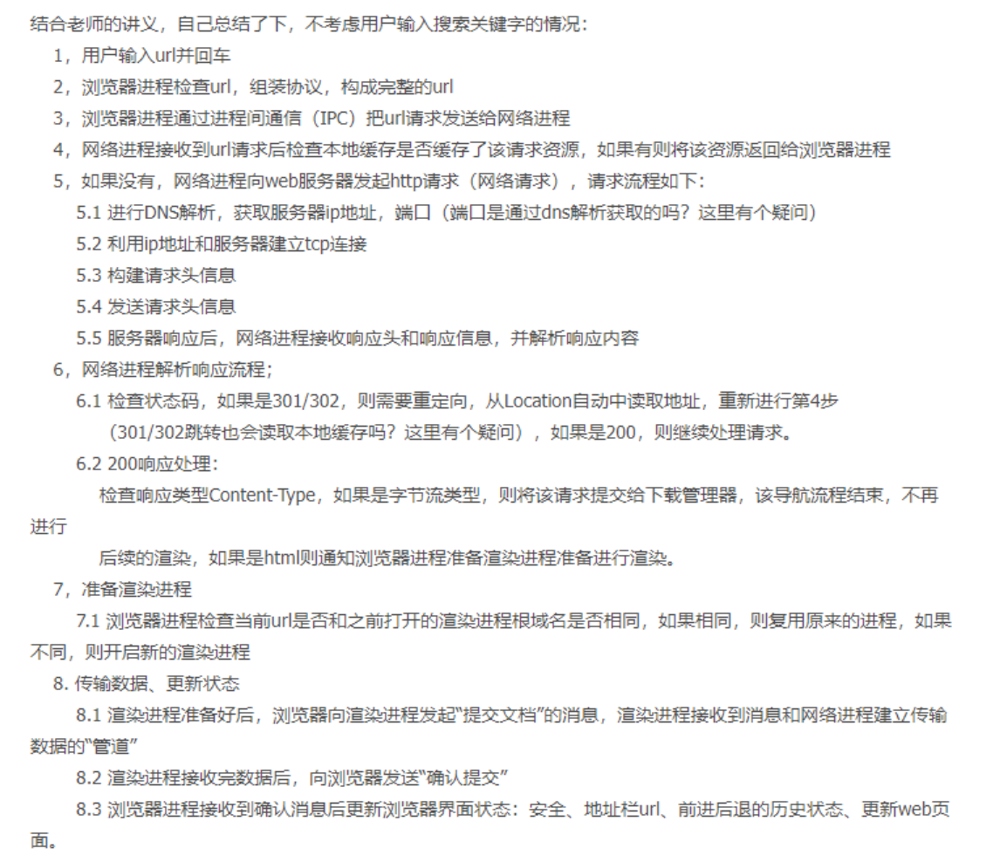
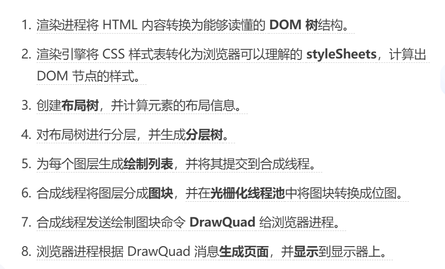

# 浏览器

## 1. 浏览器的渲染原理及流程

* 解析html构建DOM树——> 构建render树（dom树和css规则树的合并）——> 布局render树 ——> 绘制render树

* 详细版本：

  * 浏览器解析->查询缓存->dns查询->建立链接->服务器处理请求->服务器发送响应->客户端收到页面->解析HTML->构建渲染树->开始显示内容(白屏时间)->首屏内容加载完成(首屏时间)->用户可交互(DOMContentLoaded)->加载完成(load)

* 结合老师的讲义，自己总结了下，不考虑用户输入搜索关键字的情况：    1，用户输入url并回车    2，浏览器进程检查url，组装协议，构成完整的url    3，浏览器进程通过进程间通信（IPC）把url请求发送给网络进程    4，网络进程接收到url请求后检查本地缓存是否缓存了该请求资源，如果有则将该资源返回给浏览器进程    5，如果没有，网络进程向web服务器发起http请求（网络请求），请求流程如下：        5.1 进行DNS解析，获取服务器ip地址，端口（端口是通过dns解析获取的吗？这里有个疑问）        5.2 利用ip地址和服务器建立tcp连接        5.3 构建请求头信息        5.4 发送请求头信息        5.5 服务器响应后，网络进程接收响应头和响应信息，并解析响应内容    6，网络进程解析响应流程；        6.1 检查状态码，如果是301/302，则需要重定向，从Location自动中读取地址，重新进行第4步            （301/302跳转也会读取本地缓存吗？这里有个疑问），如果是200，则继续处理请求。        6.2 200响应处理：            检查响应类型Content-Type，如果是字节流类型，则将该请求提交给下载管理器，该导航流程结束，不再进行            后续的渲染，如果是html则通知浏览器进程准备渲染进程准备进行渲染。    7，准备渲染进程        7.1 浏览器进程检查当前url是否和之前打开的渲染进程根域名是否相同，如果相同，则复用原来的进程，如果不同，则开启新的渲染进程    8. 传输数据、更新状态        8.1 渲染进程准备好后，浏览器向渲染进程发起“提交文档”的消息，渲染进程接收到消息和网络进程建立传输数据的“管道”        8.2 渲染进程接收完数据后，向浏览器发送“确认提交”        8.3 浏览器进程接收到确认消息后更新浏览器界面状态：安全、地址栏url、前进后退的历史状态、更新web页面。
* 
* 渲染进程将 HTML 内容转换为能够读懂的 DOM 树结构。渲染引擎将 CSS 样式表转化为浏览器可以理解的 styleSheets，计算出 DOM 节点的样式。创建布局树，并计算元素的布局信息。对布局树进行分层，并生成分层树。为每个图层生成绘制列表，并将其提交到合成线程。合成线程将图层分成图块，并在光栅化线程池中将图块转换成位图。合成线程发送绘制图块命令 DrawQuad 给浏览器进程。浏览器进程根据 DrawQuad 消息生成页面，并显示到显示器上。
* 

## 2. 页面渲染流程阻塞问题

从首次发出url请求到页面展示过程中可以分为3个阶段：

1. 第一个阶段：等请求发出去之后，到提交数据这个阶段，这个阶段，页面展示的还是之前的内容（拼接url，查缓存，DNS请求查IP，TCP连接建立， HTTP请求, http响应（http响应码的判断，如果是301和302需要重定向））
2. 第二个阶段：提交数据之后，渲染进程创建一个空白的页面，等待css文件和js文件加载执行完成， 生成CSSOM、DOM，然后合成布局树，分层、栅格化、绘制
3. 第三个阶段：首次渲染完成之后，就进入完成页面的生成阶段，页面将会被一点一点的生成出来

**思考：**首屏时间就是从页面拿到HTML字节流之后，开始渲染的过程。那么这个过程中浏览器的任务主要是下载CSS文件、下载JS文件以及执行js脚本。所以要想缩短白屏的时间考虑从以下几个方面入手：

1. 内联css和内联js，这样就可以省去下载的时间，但是不是所有所有场合都适合用内联
2. 对于需要下载的文件，可以考虑使用webpack打包工具 ，移除不必要的注释，压缩js文件的大小
3. 对于不需要操作dom的js脚本，考虑放在文档末尾，或者使用async和defer异步加载执行
4. 对于大的css文件，通过媒体查询属性，将其拆分为多个用途的css文件，再特定的场景下加载特定的css文件。

1. js脚本问题
   * js脚本会阻塞dom的加载，从而阻塞页面的渲染。
   * 可以使用cdn来加速js文件的加载
   * 压缩js文件的体积
   * 如果js脚本中没有操作dom的相关代码，可以把该js脚本设置为异步加载。async：脚本并行加载，加载完成之后立即执行，执行时机不确定，仍有可能阻塞HTML解析，执行时机在load事件派发之前 defer：脚本并行加载，等待HTML解析完成之后，按照加载顺序执行脚本，执行时机在DOMContentLoaded事件派发之前
2. css样式加载的问题
   * css样式不会阻塞dom的加载，但是会阻塞js脚本的执行，因为js脚本中可能会操作css，所以在脚本执行之前，需要加载完该脚本之前的css文件，所以css会阻塞js脚本的执行，而js脚本会阻塞页面的渲染，所以css也有可能会间接的阻塞页面的渲染
   * 如果把css放在文档最后加载执行，这样的话，css就不会阻塞dom的加载，也不会阻塞js的加载和执行，浏览器会在解析完dom后，再解析css。这样效果不好，会先出现一个没有样式的页面，再闪动出现一个有样式的页面。所以css文件需要放在头部，尽可能的提前加载css。把js放在文档尾部，使得js不会阻塞页面的渲染。
3. 缩短首屏时长（白屏）
   * 内联css，内联js脚本，移除文件下载的消耗，使得浏览器获取到HTML后就直接开始渲染流程
   * 使用webpack打包工具移除不必要的注释，压缩js文件
   * 异步加载
   * 对于大的css文件，使用媒体查询属性，将其分为多个用途的css文件。

### 页面首次渲染VS页面渲染

* 图片、音频、视频等文件不会阻塞页面的首次渲染
* 但是JS文件、css文件、首次请求的HTML资源文件会阻塞页面的首次渲染。（需要明白页面的首次渲染：从浏览器拿到HTML文件，开始解析HTML文件，构建DOM树开始到有内容显示的过程），这个过程中构建DOM树，js文件、css文件以及请求的HTML资源文件都会阻塞DOM树的构建（css间接阻塞），在domContentloaded之前，这些文件就加载执行好了。页面有内容渲染出来。然后才是加载图片、视频等文件，这些文件在loaded事件之前执行完毕。（注意这里的JS文件和css文件的请求是通过预解析线程同步下载的）
* 阻塞页面首次渲染的资源成为关键资源（css， js, html资源文件）
* 关键资源的多少、大小以及关键资源需要多少个RTT（Round Trip Time）都是影响页面的首次渲染的
  * 减少关键的个数：可以通过内联css、js文件就可以减少关键资源个数。或者对于不操作DOM的js，可以放在文档末尾或者异步加载。对于css可以使用媒体属性，阻止加载
  * 减少关键的大小：压缩CSS和JAVASCRIPT文件，移除注释内容
  * 减少RTT：使用CDN减少每次的RTT时长

### 交互阶段的性能优化

* 交互阶段优化的核心原则是尽量减少一帧的生成时间
  1. 减少单次javascript的执行时间
  2. 避免强制同步布局，强制同步布局就是在执行js的过程中又去访问布局的信息，这样会导致在执行js的过程中去刷新布局（计算样式和布局都是在当前脚本执行过程中触发的）
  3. 避免布局抖动：在一次javascript执行过程中，多次执行强制布局
  4. 合理利用CSS合成动画，css合成动画是在合成线程上执行的，不会占用主线程
  5. 避免频繁的垃圾回收，执行垃圾回收的时候会占用主线程，从而影响其它任务的执行

### 重绘VS重排vs合成

* 重绘：改动页面元素的样式等，这些不涉及布局的重新计算，布局树的操作可以跳过，直接进行绘制
* 重排：改动页面的布局，布局树需要重新计算，开销较大
* 合成：在合成线程上操作，比如css的动画

---

* **js脚本会阻塞页面的渲染**，浏览器从上到下解析html文档并渲染，遇到`js`脚本，会将渲染线程挂起，以去执行`js`脚本。
  * 所以为了防止页面加载`js`脚本被阻塞，导致网站出现大量的空白时间。可以采用异步加载js脚本的技术。
    * 具体方法是使用`defer`和`async`。使得在浏览器解析html和渲染的同时，能够加载js脚本。因为使用`defer`和`async`，主线程会异步加载，继续解析html，`async`会在异步加载完成之后，会立即执行。`defer`会在html解析完成之后立即执行。
  * 也可以采用将js脚本放在html文档底部。这样它会在在HTTP请求的所有其他组件之后加载并执行，并且渲染过程将不会被阻塞。
  * 或者压缩和合并js文件的大小。减小文件大小，以加快文件下载和执行速度
* **使用link标签引入css文件**，遇到css文件的时候，**并不会阻塞**浏览器解析html的。因为通过标签引入的css文件是异步加载和解析的，它不会阻塞dom树的构建，但是由于css毕竟是样式文件，它会影响页面的渲染，所以如果外部css过大，会影响页面的加载速度。
* **使用内联样式**：内联样式**会影响浏览器解析html**的，因为浏览器从上到下依次加载，必须解析完内联样式，才能继续解析下面的内容，虽然内联样式减少了http请求数，如果内联样式非常复杂或者过多，可能会显著影响页面的加载性能，导致页面加载速度变慢。

---

* DOMContentLoaded: 当页面的内容解析完成后，则触发该事件    •JS 会阻塞DOM的解析和渲染，所以DOMContentLoaded会在JS执行后触发   • 因为CSS会阻塞JS执行       • 如果JS在CSS之前或只有CSS资源，则DOMContentLoaded事件不必等CSS加载完毕       • 如果页面同时存在JS和CSS且CSS在JS之前，那DOMContentLoaded事件需等待CSS加载完毕后触发 

* onLoad: 等待页面的所有资源都加载完成才会触发，这些资源包括css、js、图片视频等

## 3. WebComponent

* 三个组成要素：自定义元素、影子DOM、HTML模板
* 影子DOM：将模板中的内容与全局DOM和全局CSS进行隔离，实现元素和样式的私有化

## 4. 虚拟DOM

* 批量更新DOM，有使用到双缓存的设计（注意是批量更新DOM，那么批量更新的时间就比较重要，vue中批量更新的时间是下一次事件循环之前，本次事件循环包括同步任务、宏任务、微任务。微任务队列执行完毕，会进入执行宏任务,此时就开始了下一次事件循环）
* 虚拟DOM 并没有解决js频繁操作DOM引起的性能问题，因为虚拟DOM并没有减少操作（存疑，万一对一个节点重复操作，虚拟DOM应该是可以去重的吧？）

## 5. 浏览器中JS执行机制

### 1. 变量提升

* JS是先编译再执行。在编译阶段创建执行上下文
  * 编译阶段：会把变量的声明以及函数的声明提升到代码头部，本质并没有改动代码的位置，不过是在变量环境中存储了变量的声明以及函数的声明。变量的赋值会默认为`undefined`
  * 执行阶段：执行相应的赋值操作，从变量环境中查找赋值的变量以及函数。这个时候比如函数的声明就不会再执行了。

### 2. 执行上下文vs调用栈

* 执行全局代码的时候，创建全局执行上下文，全局执行上下文中包含变量环境和词法环境等。
* 调用函数的时候，创建函数执行上下文，
* 所以会出现多个执行上下文，JS中使用调用栈来管理执行上下文

### 3. 词法环境vs变量环境

* 执行上下文中包含词法环境和变量环境。var声明的变量存在变量提升，会被放在变量环境中。let和const声明的变量不存在变量提升，会被放在词法环境中，虽然不存在变量提升，但在词法环境中会提升变量的创建，但是不会初始化，这里是区别去var的，var提升了变量的创建，并初始化为undefined。let和const不会初始化，所以如果在let初始化之前访问的话，会报错`“Uncaught ReferenceError: Cannot access 'myname' before initialization”`，且let和const是块级作用域，块级作用域内的变量，外面是访问不到的。这是通过在词法环境中实现类似执行栈的结构来实现的。

* 块级作用域就是通过词法环境的栈结构来实现的，而变量提升是通过变量环境来实现，通过这两者的结合，JavaScript 引擎也就同时支持了变量提升和块级作用域了

* 在块作用域内，let声明的变量被提升，但变量只是创建被提升，初始化并没有被提升，在初始化之前使用变量，就会形成一个暂时性死区

  ```js
  let myname= '极客时间'
  {
    console.log(myname) 
    let myname= '极客邦'
  }
  ```

## 4. 词法作用域

* 词法作用域：作用域由代码中函数声明的位置来决定的。词法作用域是静态作用域
* 词法作用域是代码编译阶段就决定好的，和函数怎么调用没有关系
* js执行过程中，作用域链由词法作用域来决定。

